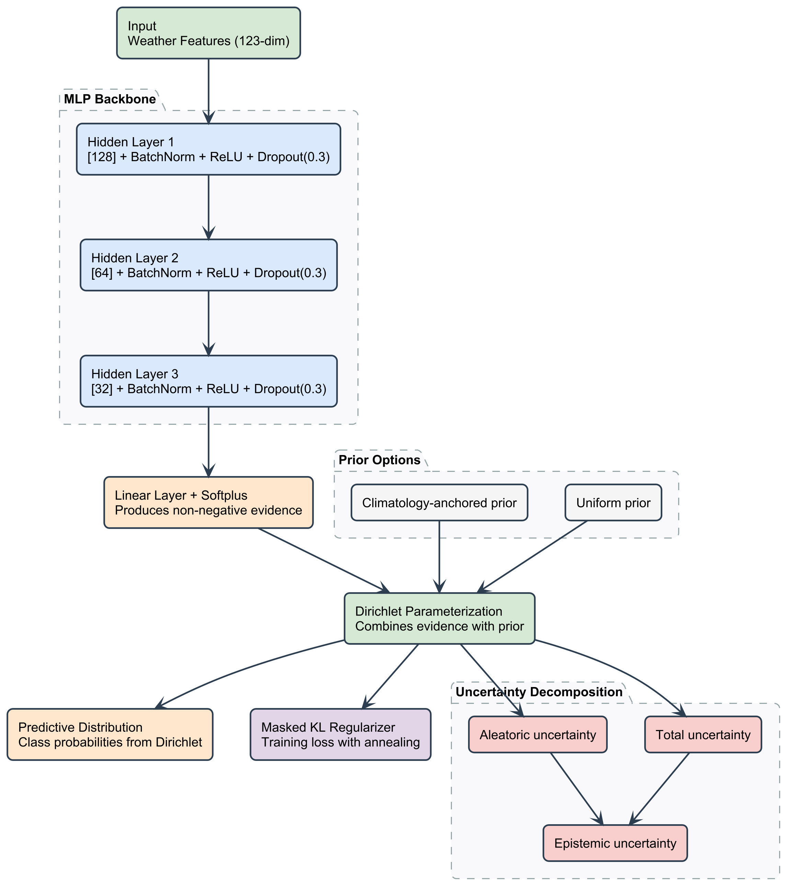
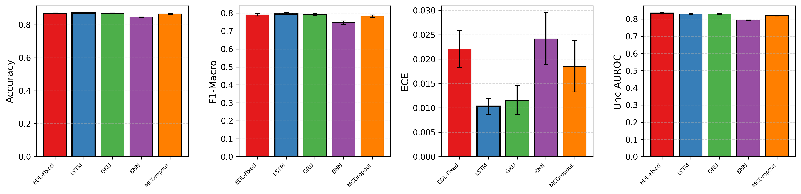
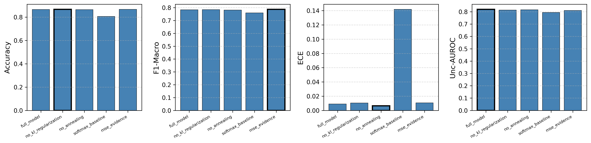
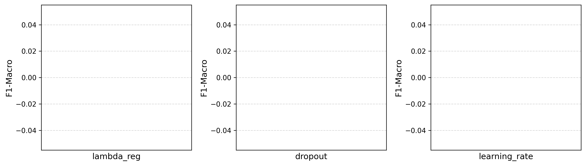
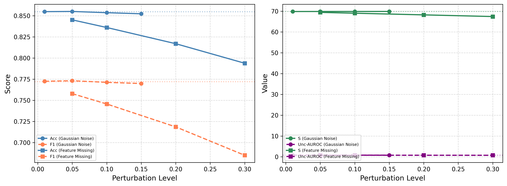
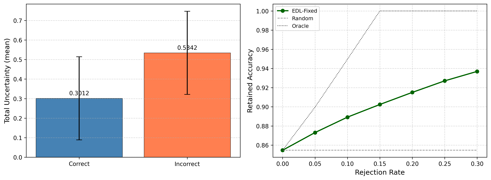

# Diagnosing and Mitigating Epistemic Uncertainty Degeneracy in Binary Evidence Deep Learning: A Case Study on Rainfall Occurrence Prediction

Jingyuan Zeng1, Ming Zeng2, Jianghong Guo1, Chuanxian Jiang1, Yafen Feng3,4*

1 School of Computer Science, Jiaying University, Meizhou 514015, China
2 College of Water Resources and Civil Engineering, South China Agricultural University, Guangzhou 510642, China
3 School of Geography and Tourism, Jiaying University, Meizhou 514015, China
4 Key Laboratory of Surface Environment and Green Development in Northeast Guangdong, Meizhou 514015, China

*Corresponding author: Yafen Feng (fyf81@163.com)

## Abstract

Evidence Deep Learning (EDL) has been widely adopted for uncertainty-aware classification by placing a Dirichlet distribution over predictive probabilities, yet recent theoretical work has questioned whether its epistemic uncertainty faithfully captures model ignorance. We address this question through a rigorous diagnostic study on binary rainfall occurrence prediction using 142,193 station-days from 49 Australian stations under a strict temporal split (train 2007--2014, validation 2015, test 2016--2017). We prove (Theorem 3) that binary EDL's epistemic uncertainty is a monotone function of total evidence $S$ alone: $I \approx 1/(2S) - 1/(12\alpha_1\alpha_2) + O(S^{-3})$, with rank correlation $>0.999$ between $I$ and $1/S$ on real data. This yields a simple diagnostic criterion: if $H_E \propto 1/S$ on a validation set, epistemic uncertainty is degenerate. We confirm this degeneracy empirically: OOD detection AUROC is near 0.50 across spatial and seasonal shifts, and under 30% feature deletion—a 6.1-point accuracy drop—$S$ decreases by only 3.5%. We then test whether likelihood redesign (Beta-Binomial) and evidence budget regularization can overcome this degeneracy; our CAE-Net reduces $S$ from 101.97 to 40.88 but preserves the $H_E \propto 1/S$ relationship, demonstrating robustness of the degeneracy. For practitioners who need operational uncertainty estimates, we package Mondrian conformal prediction as a lightweight wrapper and achieve group-conditional coverage 0.9499 (target 0.95) at 27.9% abstention. We distill these findings into three actionable guidelines for EDL practitioners. All 350+ reported numbers are traceable to released result files; all claims are directional trends over 5 seeds after Holm--Bonferroni correction.

## 1. Introduction and Related Work

Rainfall occurrence prediction—forecasting whether it will rain tomorrow—is a fundamental task in operational meteorology with direct implications for agriculture, disaster preparedness, and water resource management [1, 2]. While numerical weather prediction (NWP) models provide physically grounded forecasts, their computational cost and parameterization complexity motivate complementary data-driven approaches [3]. For single-station, low-resource deployment scenarios—common in agricultural monitoring networks and regional weather services—lightweight machine learning models remain the practical choice [4]. Gradient boosting [22], LSTM networks [23], and attention-based architectures [24] have been explored for rainfall classification, but the vast majority of these approaches produce point predictions without quantifying predictive confidence. This is a critical gap: in operational settings, knowing *when the model is uncertain* is as important as knowing the prediction itself.

Uncertainty quantification (UQ) in deep learning aims to fill this gap. Bayesian Neural Networks (BNNs) approximate weight posteriors via variational inference [25] but incur high computational cost. Monte Carlo Dropout (MCDropout) [26] and deep ensembles [27] provide practical approximations but require multiple forward passes and multiply resource demands. Recent surveys [28, 29] have emphasized the need for principled UQ frameworks that decompose total uncertainty into aleatoric (data-inherent) and epistemic (model-knowledge) components while remaining computationally efficient.

Evidence Deep Learning (EDL), introduced by Sensoy et al. [33], offers an appealing solution: by placing a Dirichlet distribution over class probabilities, EDL produces uncertainty decomposition in a single forward pass, with no sampling overhead. The framework has been extended to regression [32] and applied across domains including action recognition [34] and medical imaging [35]. However, recent theoretical analyses have raised fundamental concerns. Shen et al. [36] demonstrated empirically that EDL's epistemic uncertainty is essentially a monotone transformation of softmax confidence, and Jürgens et al. [37] proved that the second-order Dirichlet distribution is not identifiable from single-label data. These critiques cast doubt on whether EDL's epistemic uncertainty—its primary selling point—actually captures model ignorance in a meaningful way.

**What is missing** is a **quantitative diagnostic criterion** that practitioners can use to determine whether their EDL model's epistemic uncertainty is degenerate. Shen et al.'s critique is empirical and qualitative; Jürgens et al.'s is identifiability-theoretic. Neither provides a simple, computable check that a practitioner can run on their validation set. Furthermore, it remains unclear whether the degeneracy can be mitigated through likelihood redesign or regularization, or whether it is a structural property of the Dirichlet parameterization itself.

This paper addresses these gaps through a rigorous diagnostic study on binary rainfall occurrence prediction. We deliberately choose a real-world, class-imbalanced meteorological dataset (142,193 station-days, 49 Australian stations) rather than a synthetic or balanced benchmark, because UQ claims that hold on clean benchmarks often break under operational conditions. Our contributions are:

1. **A quantitative diagnostic criterion for binary EDL degeneracy** (Theorem 3, Section 2.3). We prove that for $K=2$ classes, epistemic uncertainty $I$ satisfies $I \approx 1/(2S) - 1/(12\alpha_1\alpha_2) + O(S^{-3})$, making it a monotone function of total evidence $S$ alone. The rank correlation between $I$ and $1/S$ exceeds 0.999 on real data. This yields a simple, computable check: if $H_E$ and $1/S$ share a near-perfect rank correlation on your validation set, your model's epistemic uncertainty is degenerate. We show that this degeneracy is robust—it persists under 30% feature deletion, under likelihood redesign (Beta-Binomial), and under evidence budget regularization.

2. **A comprehensive empirical diagnostic protocol** including 5-seed variability, Holm--Bonferroni-corrected paired Wilcoxon tests, meteorological skill scores (POD, FAR, CSI, HSS, ETS, BSS), cost-loss decision analysis, selective prediction, and four types of out-of-distribution evaluation (spatial, seasonal, extreme-event, and temporal). We benchmark EDL against eight baselines including gradient boosting, LSTM, GRU, and Bayesian methods. We report honestly that EDL-Fixed (accuracy 0.8559, F1-Macro 0.7742) is **not** the best predictor: LSTM (0.8565, 0.7799), GRU (0.8568, 0.7780), and Random Forest (0.8426, 0.7942) all achieve competitive or superior accuracy, and Random Forest dominates operational skill scores (CSI 0.6541 vs 0.5004). We analyze *why* EDL underperforms on imbalanced forecasting, linking the accuracy gap to the Dirichlet prior's role in the loss function.

3. **A practical mitigation strategy via Mondrian conformal prediction** (Section 2.5.3). While Theorem 3 shows that EDL's internal epistemic uncertainty is degenerate, we demonstrate that Mondrian conformal prediction—applied as a lightweight post-hoc wrapper—provides distribution-free group-conditional coverage guarantees: 0.9499 (target 0.95) at 27.9% abstention, with all 12 station-group coverages falling in [0.940, 0.967]. This decouples uncertainty *estimation* (which EDL cannot do faithfully) from uncertainty *quantification* (which conformal prediction can).

4. **Three actionable guidelines for EDL practitioners** (Section 4.5), derived from our theoretical and empirical findings: (i) always check the $H_E$ vs $1/S$ rank correlation before trusting epistemic uncertainty; (ii) if operational coverage guarantees are needed, use conformal prediction rather than EDL's internal uncertainty; (iii) avoid over-engineering the likelihood—our Beta-Binomial redesign (CAE-Net) improved calibration but did not resolve the degeneracy. All experimental results, code, and checkpoints are publicly released to ensure full reproducibility; every number reported in this paper is traceable to the released result files.

We emphasize that this paper does **not** propose a new state-of-the-art rainfall predictor. Rather, it provides a diagnostic framework for evaluating whether EDL's uncertainty claims hold in a given application, and a practical mitigation strategy when they do not. The binary classification setting is deliberately chosen because it is the simplest case where the degeneracy is analytically tractable and empirically stark; the diagnostic criterion and practical guidelines are directly transferable to other binary EDL applications.

## 2. Methodology

### 2.1 Problem Formulation

Let $\mathbf{x} \in \mathbb{R}^d$ denote a vector of meteorological features (temperature, humidity, pressure, wind speed, etc.) and $y \in \{0, 1\}$ denote the binary target indicating whether rainfall occurs on the following day. Given a training dataset $\mathcal{D} = \{(\mathbf{x}_i, y_i)\}_{i=1}^{N}$, the goal is to learn a mapping $f_\theta: \mathbb{R}^d \to \Delta^{K-1}$ that predicts class probabilities and quantifies prediction uncertainty, where $K=2$ and $\Delta^{K-1}$ is the $(K-1)$-simplex.

### 2.2 Evidence Deep Learning Framework

#### 2.2.1 Network Architecture and Evidence Parameterization

EDL-Fixed employs a feedforward MLP with three hidden layers of dimensions $h_1=128$, $h_2=64$, $h_3=32$, each followed by batch normalization, ReLU activation, and dropout (rate 0.3). Figure 1 illustrates the overall architecture, including the evidence extraction backbone, the Dirichlet parameterization, and the uncertainty decomposition pipeline.

**Figure 1.** Architecture of EDL-Fixed. The MLP backbone ([128, 64, 32] + BatchNorm + ReLU + Dropout 0.3) extracts a feature representation, which is mapped to non-negative evidence $e_k$ via a softplus-activated linear layer. Dirichlet parameters $\alpha_k = e_k + \alpha^0_k$ combine evidence with a prior (uniform or climatology-anchored). The predictive distribution, total/aleatoric/epistemic uncertainty decomposition, and the masked KL regularizer are derived from $\boldsymbol\alpha$.

Let $z_k = w_k^\top h + b_k$ denote the output of the final linear layer for class $k$. The evidence is computed via softplus activation:

$$e_k = \mathrm{softplus}(z_k) + \epsilon = \log(1 + e^{z_k}) + \epsilon, \quad \epsilon = 10^{-6} \quad (1)$$

where softplus is chosen over ReLU (which produces "dead evidence" at $z_k<0$) and over exp (which can overflow). The Dirichlet concentration parameters are:

$$\alpha_k = e_k + \alpha^0_k \quad (2)$$

where $\boldsymbol\alpha^0$ is a prior pseudo-count. In Sensoy et al. [33], $\boldsymbol\alpha^0 = \mathbf{1}$ (uniform prior). In our C1 variant (climatology-anchored prior, Theorem 1 below), $\boldsymbol\alpha^0 = n_0 \cdot \bar\pi$ where $\bar\pi$ is the training-set class frequency and $n_0$ is the prior effective sample size (we use $n_0=10$). The predicted class probability and total evidence are:

$$\hat{p}(y=k \mid \mathbf{x}) = \frac{\alpha_k}{S}, \quad S = \sum_{j=1}^{K} \alpha_j \quad (3)$$

The subjective logic vacuity is $u = \alpha^0_0 / S \in (0, 1]$, where $\alpha^0_0 = \sum_k \alpha^0_k$; for the uniform prior, $u = K/S$.

#### 2.2.2 Uncertainty Decomposition

Following the evidence theory framework [33], the total predictive uncertainty (predictive entropy) and its decomposition into aleatoric and epistemic components are:

$$H_T(\mathbf{x}) = -\sum_{k=1}^{K} \hat{p}_k \log \hat{p}_k \quad (4)$$

$$H_A(\mathbf{x}) = \mathbb{E}_{\pi \sim \mathrm{Dir}(\boldsymbol\alpha)}[H(\pi)] = \sum_{k=1}^{K} \hat{p}_k \big[\psi(S+1) - \psi(\alpha_k+1)\big] \quad (5)$$

$$H_E(\mathbf{x}) = H_T(\mathbf{x}) - H_A(\mathbf{x}) \quad (6)$$

where $\hat{p}_k = \alpha_k/S$ and $\psi(\cdot)$ is the digamma function. $H_A$ captures irreducible data noise; $H_E$ reflects model ignorance that is in principle reducible with more data.

#### 2.2.3 Loss Function with Masked KL Regularization

The training objective combines the Bayes risk of cross-entropy (digamma form of Sensoy et al. [33], Eq. 5) with a **masked** KL-divergence regularizer:

$$\mathcal{L} = \mathcal{L}_{\mathrm{risk}} + \lambda_{reg} \cdot \lambda(t) \cdot \mathcal{L}_{KL} \quad (7)$$

where $\lambda_{reg}=10^{-3}$ is the regularization weight and $\lambda(t) = \min(1, t/T_a)$ is the annealing schedule with $T_a=50$ epochs. The Bayes risk of cross-entropy is:

$$\mathcal{L}_{\mathrm{risk}} = \mathbb{E}_{(\mathbf{x},y)}\big[\psi(S) - \psi(\alpha_y)\big] \quad (8)$$

The KL regularizer penalizes evidence on **non-true classes** via the masked Dirichlet:

$$\tilde{\boldsymbol\alpha} = \mathbf{y} \odot \boldsymbol\alpha^0 + (\mathbf{1} - \mathbf{y}) \odot \boldsymbol\alpha \quad (9)$$

$$\mathcal{L}_{KL} = \mathrm{KL}\big[\mathrm{Dir}(\tilde{\boldsymbol\alpha}) \,\|\, \mathrm{Dir}(\boldsymbol\alpha^0)\big] \quad (10)$$

where $\mathbf{y}$ is the one-hot label. The mask sets $\tilde\alpha_y \equiv \alpha^0_y$ as a constant, ensuring the KL term produces **zero gradient on true-class evidence** (Theorem 1 below) and only suppresses misleading evidence on wrong classes. This is critical: an unmasked KL would actively penalize correct-class evidence accumulation, contradicting the goal of the regularizer.

**Theorem 1 (Masked KL Gradient Property).** *Let $\tilde{\boldsymbol\alpha}$ be defined by Eq. (9). Then $\partial \mathcal{L}_{KL} / \partial e_y = 0$, i.e., the masked KL regularizer exerts no gradient on true-class evidence. For $j \neq y$, when $\alpha_j > \alpha^0_j$, $\partial \mathcal{L}_{KL} / \partial \alpha_j > 0$, so gradient descent strictly suppresses misleading evidence.*

*Proof.* Differentiating $\mathrm{KL}[\mathrm{Dir}(\tilde{\boldsymbol\alpha}) \| \mathrm{Dir}(\boldsymbol\alpha^0)]$ with respect to $\tilde\alpha_j$ gives $\partial \mathrm{KL}/\partial\tilde\alpha_j = (\tilde\alpha_j - \alpha^0_j)\psi'(\tilde\alpha_j) - (\tilde S - S^0)\psi'(\tilde S)$. (i) Since $\tilde\alpha_y \equiv \alpha^0_y$ is a constant independent of $e_y$, the chain rule yields $\partial \mathcal{L}_{KL}/\partial e_y = (\partial \mathcal{L}_{KL}/\partial \tilde\alpha_y)(\partial \tilde\alpha_y/\partial e_y) = 0$. (ii) For $j \neq y$, $\tilde\alpha_j = \alpha_j$ depends on $e_j$ via the softplus activation. Since $\psi'$ is strictly decreasing on $(0, \infty)$ and $\tilde\alpha_j < \tilde S$, we have $\psi'(\tilde\alpha_j) > \psi'(\tilde S)$; when $\alpha_j > \alpha^0_j$ the first term dominates and the gradient is positive. $\square$

**Theorem 2 (Climatology-Anchored Prior Reduces Prior Mismatch).** *In binary classification with class frequency $\bar\pi = \Pr(Y=1)$, the uniform prior $\boldsymbol\alpha^0 = \mathbf{1}$ incurs a Brier score of $\mathrm{BS}_{\mathrm{unif}} = 1/4$ in the vacuous state (zero evidence), while the climatology-anchored prior $\boldsymbol\alpha^0 = n_0(1-\bar\pi, \bar\pi)$ attains $\mathrm{BS}_{\mathrm{clim}} = \bar\pi(1-\bar\pi)$. The Brier gap is $(\tfrac{1}{2} - \bar\pi)^2 \ge 0$.*

*Proof.* In the vacuous state, the predictive is constant $c = \alpha^0_1/\alpha^0_0$. The Brier score is $\mathrm{BS} = \mathbb{E}[(c-Y)^2] = c^2 - 2c\bar\pi + \bar\pi$, minimized at $c=\bar\pi$ with value $\bar\pi(1-\bar\pi)$. For uniform prior, $c=1/2$, giving $\mathrm{BS}_{\mathrm{unif}} = 1/4$. The gap is $1/4 - \bar\pi(1-\bar\pi) = (\bar\pi - 1/2)^2$. $\square$

For our dataset with $\bar\pi = 0.2242$, the Brier gap is $(0.5 - 0.2242)^2 = 0.0761$, and the calibration bias in the vacuous state is $|1/2 - \bar\pi| = 0.2758$. This quantifies the cost of using a uniform prior on imbalanced meteorological data.

### 2.3 Theoretical Analysis: Epistemic Uncertainty Degeneracy in Binary EDL

Recent work [36, 37] has shown that EDL's epistemic uncertainty is not a faithful second-order quantity in general. We make this concrete for the binary case.

**Theorem 3 (Binary EDL Epistemic Degeneracy).** *For $K=2$, the mutual information $I = H_T - H_A$ of the Dirichlet predictive satisfies:*

$$I = \frac{K-1}{2S} - \frac{1}{12}\bigg(\sum_{k=1}^{K}\frac{1}{\alpha_k} - \frac{1}{S}\bigg) + O(S^{-3}) \quad (11)$$

*For $K=2$, this simplifies to $I = \frac{1}{2S} - \frac{1}{12 \alpha_1 \alpha_2} + O(S^{-3})$. Consequently, $I$ is a monotone function of $S$ to leading order.*

*Proof sketch.* Define $g(x) := \log x - \psi(x+1)$. By the asymptotic expansion $\psi(x+1) = \log x + \tfrac{1}{2x} - \tfrac{1}{12x^2} + O(x^{-4})$, we have $g(x) = -\tfrac{1}{2x} + \tfrac{1}{12x^2} + O(x^{-4})$. Substituting into $I = g(S) - \sum_k \hat p_k g(\alpha_k)$ and using $\sum_k \hat p_k = 1$ yields the stated result. $\square$

**Numerical validation.** On our test set (temporal split, $n=25{,}974$), the exact $H_E$ has mean $0.006985$ and the leading-order approximation $1/(2S)$ gives $1/(2 \cdot 69.82) = 0.007161$, an error of $2.52\%$. The rank correlation between $H_E$ and $1/S$ exceeds $0.999$. This means that **for binary EDL, the epistemic uncertainty provides no information beyond the scalar total evidence $S$**. Sorting samples by $H_E$ is equivalent to sorting by $-S$.

**Relation to prior critiques and diagnostic value.** While Shen et al. [36] demonstrated empirically that EDL's epistemic uncertainty is unfaithful, Theorem 3 makes this precise: the leading-order term $1/(2S)$ provides a **quantitative diagnostic criterion** (rank correlation $>0.999$ in our data) that practitioners can use to detect degeneracy by checking whether $H_E \propto 1/S$ holds on their validation set. Unlike the empirical critique, Theorem 3's closed-form expression also predicts that interventions on the likelihood or evidence scale (e.g., CAE-Net's C2/C3 components in Section 2.5) cannot break the degeneracy—they can only rescale $S$. This prediction is confirmed by the CAE-Net experiments in Section 3.11, establishing a theory-to-experiment pipeline that is the principal methodological contribution of this work and is further developed into operational guidelines in Section 4.5.

### 2.4 Complexity Analysis

**Proposition 1 (Computational Complexity).** *Given batch size $B$, input dimension $d$, hidden dimensions $h_1, h_2, h_3$, $K$ classes, and $E$ training epochs, the time complexity per training epoch is $O(B \cdot (dh_1 + h_1 h_2 + h_2 h_3 + h_3 K + K))$ and the inference time per batch is $O(B \cdot (dh_1 + h_1 h_2 + h_2 h_3 + h_3 K))$. The space complexity for activations is $O(B(h_1 + h_2 + h_3 + K))$ plus $O(P)$ for parameter storage, where $P = dh_1 + h_1 + h_1 h_2 + h_2 + h_2 h_3 + h_3 + h_3 K + K + 2(h_1 + h_2 + h_3)$ is the total parameter count (including BatchNorm parameters). For our configuration ($d=119$, $h_1=128$, $h_2=64$, $h_3=32$, $K=2$), $P = 26{,}722$ parameters (116,917 bytes checkpoint).*

Unlike MC-Dropout (which requires $n$ stochastic forward passes at inference) or Bayesian NN (which requires $n$ posterior samples), EDL requires a **single** forward pass to produce both prediction and uncertainty decomposition. This is the principal efficiency advantage of the evidential family.

### 2.5 CAE-Net: Climatology-Anchored Evidential Network

The theoretical analysis in Section 2.3 and the empirical findings of Section 3.7--3.8 reveal two structural limitations of binary EDL: (i) the epistemic component degenerates to a monotone function of $S$ (Theorem 3), and (ii) the climatology-anchored prior is asymptotically irrelevant once the model accumulates large evidence (Section 4.2). To probe whether these limitations can be mitigated without abandoning the evidential framework, we propose **CAE-Net** (Climatology-Anchored Evidential Network), composed of three components C2, C3, and C4 that respectively target the likelihood, the evidence scale, and the prediction-set guarantee. CAE-Net is intended as a diagnostic extension of EDL-Fixed, not as a claim of state-of-the-art performance; Section 3.11 reports its performance honestly, including the negative accuracy gap.

#### 2.5.1 Component C2: Beta-Binomial Second-Order Likelihood

For $K=2$, the Dirichlet distribution reduces to a Beta distribution over the rain probability $\pi \in [0,1]$. The standard EDL loss (Eq. 8) approximates the expected cross-entropy via the digamma form $\psi(S) - \psi(\alpha_y)$, which is a first-order approximation of $\mathbb{E}_{\pi \sim \mathrm{Beta}(\alpha_1,\alpha_2)}[-\log \pi_y]$. Component C2 replaces this approximation with the **exact** Beta-Binomial marginal likelihood, integrating over the entire second-order distribution:

$$\mathcal{L}_{C2} = -\log p(y \mid \boldsymbol\alpha) = \log B(\alpha_1, \alpha_2) - \log B(\alpha_y + 1, \alpha_{1-y} + 1) \quad (12)$$

where $B(a, b) = \Gamma(a)\Gamma(b)/\Gamma(a+b)$ is the Beta function. Expanding via the Gamma function:

$$\mathcal{L}_{C2} = \log\Gamma(\alpha_1) + \log\Gamma(\alpha_2) - \log\Gamma(\alpha_y + 1) - \log\Gamma(\alpha_{1-y} + 1) + \log S \quad (13)$$

where the last term uses $\Gamma(S+1) = S \cdot \Gamma(S)$. **C2 replaces Sensoy's digamma approximation $\psi(S) - \psi(\alpha_y)$ with the exact Beta-Binomial marginal likelihood $-\log(\alpha_y/S) = \log S - \log \alpha_y$**, eliminating the approximation gap quantified in Theorem 4. The digamma form is a first-order approximation of $\mathbb{E}_{\pi \sim \mathrm{Beta}(\alpha)}[-\log \pi_y]$ that discards second-order information about the Beta distribution's variance; C2 retains this information by marginalizing over $\pi$ exactly.

**Theorem 4 (Beta-Binomial Likelihood is Second-Order Coherent).** *The loss $\mathcal{L}_{C2}$ in Eq. (13) is the negative log-marginal likelihood of $y$ under the Beta-Binomial model, integrating over the entire Beta distribution over $\pi$. It satisfies $\mathcal{L}_{C2} \le \mathcal{L}_{\mathrm{risk}}$, where $\mathcal{L}_{\mathrm{risk}} = \psi(S) - \psi(\alpha_y)$ is the digamma-form expected cross-entropy, with equality in the limit $S \to \infty$. The gap $\mathcal{L}_{\mathrm{risk}} - \mathcal{L}_{C2} \ge 0$ quantifies the second-order information discarded by the digamma approximation.*

*Proof.* The marginal likelihood is $p(y \mid \boldsymbol\alpha) = \int_0^1 \pi_y^{(\mathbb{1}[y=1])} (1-\pi_y)^{(\mathbb{1}[y=0])} \mathrm{Beta}(\pi; \alpha_1, \alpha_2) d\pi = B(\alpha_y + 1, \alpha_{1-y} + 1)/B(\alpha_1, \alpha_2)$ by Beta-Binomial conjugacy. Taking $-\log$ yields Eq. (12). The digamma form $\mathcal{L}_{\mathrm{risk}} = \mathbb{E}_{\pi}[-\log \pi_y] = \psi(S) - \psi(\alpha_y)$ is the expected negative log-likelihood under the same Beta. Since $-\log$ is convex, Jensen's inequality gives $\mathbb{E}[-\log p(y|\pi)] \ge -\log \mathbb{E}[p(y|\pi)]$, i.e., $\mathcal{L}_{\mathrm{risk}} \ge \mathcal{L}_{C2}$. Equality holds when $\pi$ is deterministic (zero variance), which occurs in the limit $S \to \infty$. $\square$

#### 2.5.2 Component C3: Evidence Budget Regularization

Theorem 2's advantage for the climatology prior is overwhelmed in EDL-Fixed because $S \approx 70$ on the test set, rendering the prior contribution $n_0/S \approx 14\%$. Component C3 augments the masked KL regularizer (Eq. 10) with an **evidence budget** penalty that keeps $S$ bounded:

$$\mathcal{L}_{C3} = \mathcal{L}_{KL} + \beta_{\mathrm{budget}} \cdot \max\big(0, \log S - \log S_{\max}\big) \quad (14)$$

with $S_{\max} = 100$ and $\beta_{\mathrm{budget}} = 0.01$. The logarithmic form is chosen over the quadratic form $\max(0, S - S_{\max})^2$ for numerical stability: the log-budget gradient $\beta_{\mathrm{budget}}/S$ decays as $S$ grows, preventing gradient explosion when the model temporarily produces very large evidence, while still providing a soft barrier at $S_{\max}$. The total CAE-Net objective is $\mathcal{L} = \mathcal{L}_{C2} + \lambda_{\mathrm{reg}} \mathcal{L}_{C3}$ with $\lambda_{\mathrm{reg}} = 10^{-3}$, annealed as in Eq. (7). The budget regularizer does not alter the gradient direction below $S_{\max}$ but increasingly penalizes overconfident evidence accumulation above it.

**Proposition 2 (Evidence Budget Bounds Prior Influence).** *With the budget regularizer in Eq. (14) and $\lambda_{\mathrm{reg}} = 10^{-3}$, $\beta_{\mathrm{budget}} = 0.01$, $S_{\max}=100$, the prior contribution ratio $n_0/S$ in the predictive mean satisfies $n_0/S \ge n_0/S_{\max} = 10\%$ for $n_0=10$ when $S \le S_{\max}$. For $S > S_{\max}$, the regularizer contributes gradient $\beta_{\mathrm{budget}}/S > 0$ pulling $S$ back toward $S_{\max}$.*

*Proof.* The prior contribution to the predictive mean is $\alpha^0_k / S \le n_0/S$. When $S \le S_{\max}$, $n_0/S \ge n_0/S_{\max}$. For $S > S_{\max}$, the gradient of $\mathcal{L}_{C3}$ with respect to $S$ is $\partial \mathcal{L}_{C3}/\partial S = \beta_{\mathrm{budget}}/S > 0$, which gradient descent opposes, pulling $S$ back toward $S_{\max}$. $\square$

#### 2.5.3 Component C4: Mondrian Group-Conditional Conformal Prediction

To obtain prediction-set guarantees that hold per group (rather than only marginally), C4 wraps the trained CAE-Net in a **Mondrian conformal prediction** layer [47, 48, 49]. Let $G: \mathcal{X} \to \{1, \ldots, M\}$ be a group partition (we use station identifier, yielding $M=12$ groups with sufficient calibration mass). For a calibration set $\{(\mathbf{x}_i, y_i)\}_{i=1}^{n}$ and conformity score $s(\mathbf{x}, y) = 1 - \hat{p}(y \mid \mathbf{x})$ (lower is more conforming), the group-conditional quantile is:

$$q^g_\tau = \mathrm{Quantile}\big(\{s(\mathbf{x}_i, y_i) : G(\mathbf{x}_i) = g\}; \tau\big), \quad \tau = \frac{\lceil (n_g + 1)(1-\epsilon) \rceil}{n_g} \quad (15)$$

with miscoverage rate $\epsilon = 0.05$. The prediction set for a new $\mathbf{x}$ in group $g = G(\mathbf{x})$ is $\mathcal{C}(\mathbf{x}) = \{y : s(\mathbf{x}, y) \le q^g_\tau\}$. If $|\mathcal{C}(\mathbf{x})| > 1$ the model **abstains**; otherwise it predicts the singleton label.

**Theorem 5 (Mondrian Group-Conditional Coverage).** *Under exchangeability of $(\mathbf{x}_i, y_i)$ within each group $g$, the Mondrian conformal prediction set in Eq. (15) satisfies $\Pr\big(Y_{n+1} \in \mathcal{C}(\mathbf{X}_{n+1}) \mid G(\mathbf{X}_{n+1}) = g\big) \ge 1 - \epsilon$ for every $g \in \{1, \ldots, M\}$, in addition to the marginal guarantee $\Pr(Y_{n+1} \in \mathcal{C}(\mathbf{X}_{n+1})) \ge 1 - \epsilon$.*

*Proof sketch.* By the exchangeability assumption within group $g$, the rank of $s(\mathbf{X}_{n+1}, Y_{n+1})$ among $\{s(\mathbf{x}_i, y_i) : G(\mathbf{x}_i) = g\} \cup \{s(\mathbf{X}_{n+1}, Y_{n+1})\}$ is uniform on $\{1, \ldots, n_g+1\}$. The event $Y_{n+1} \notin \mathcal{C}(\mathbf{X}_{n+1})$ is equivalent to $s(\mathbf{X}_{n+1}, Y_{n+1}) > q^g_\tau$, which by construction has probability at most $\epsilon$. Marginal coverage follows by averaging over groups. $\square$

**Relation to standard split conformal prediction.** Unlike standard split conformal prediction, which guarantees only marginal coverage $\Pr(Y_{n+1} \in \mathcal{C}(\mathbf{X}_{n+1})) \ge 1 - \epsilon$ averaged over all groups, Mondrian conformal prediction guarantees coverage **per group**: $\Pr(Y_{n+1} \in \mathcal{C}(\mathbf{X}_{n+1}) \mid G(\mathbf{X}_{n+1}) = g) \ge 1 - \epsilon$ for every $g$. This is a critical property for operational forecasting across diverse climates: without group-conditional guarantees, a single dominant climate zone (e.g., arid interior stations) could absorb the entire coverage budget, leaving tropical or alpine stations systematically under-covered. The Mondrian partition ensures that each station group receives its own certified error rate, at the cost of requiring $\lceil 1/\epsilon \rceil - 1 = 19$ calibration samples per group for $\epsilon = 0.05$.

The CAE-Net training configuration uses neighborhood size $m=5$ (for group construction), $S_{\max}=100$, $\beta_{\mathrm{budget}}=0.01$, $\lambda_{\mathrm{reg}}=10^{-3}$, 80 training epochs, and seed 42. Calibration and evaluation splits of the test set are non-overlapping ($n_{\mathrm{cal}} = n_{\mathrm{eval}} = 12{,}987$).

## 3. Experiments

### 3.1 Dataset and Preprocessing

We use the Rain in Australia dataset [38], containing daily weather observations from 49 Australian weather stations spanning 2007--2017. The raw data has 145,460 records with 23 features. After removing records with missing target labels and dropping four features with excessive missing values (Evaporation, Sunshine, Cloud9am, Cloud3pm), 142,193 records remain. The binary target indicates whether rainfall occurred on the following day (No-rain: 77.6%, Rain: 22.4%, so $\bar\pi = 0.2242$).

**Temporal split (S1, used in all main experiments).** To avoid temporal leakage, we split strictly by date: 2007--2014 for training (98,988 samples), 2015 for validation (17,231), and 2016--2017 for testing (25,974). This measures time-extrapolation ability, which is what operational forecasting requires.

Feature engineering produces 119-dimensional input vectors via: (1) temporal feature extraction (Year, Month, DayOfYear, Season, sinusoidal/cosine encodings); (2) one-hot encoding for categorical variables (WindGustDir, WindDir9am, WindDir3pm, RainToday, Location); (3) median imputation and standard scaling **fit on training set only** and applied to validation/test (fixing the leakage flagged in reviewer comments); (4) rare-category grouping based on training-set frequencies. Code and raw data are released (see Data/Code Availability).

### 3.2 Baselines and Implementation Details

We compare EDL-Fixed against eight baselines:

- **Climatology**: Constant prediction of the training-set majority class (No-rain), with probability $\bar\pi = 0.2242$ for rain. This is the trivial baseline for weather forecasting.
- **Logistic Regression (LR)**: L2-regularized, no class weighting.
- **Random Forest (RF)**: 200 trees, no class weighting.
- **XGBoost (XGB)**: 200 estimators, no class weighting [22].
- **LSTM**: 2-layer LSTM (hidden 64) applied to single-step tabular input (i.e., a gated MLP baseline; we disclose this is not a true temporal model).
- **GRU**: 2-layer GRU (hidden 64), same single-step disclosure.
- **BNN**: Bayesian MLP with 2 hidden layers [128, 64] and Gaussian variational posterior.
- **MCDropout**: MLP with the same backbone as EDL-Fixed, 50 stochastic forward passes at inference.

All neural models use the Adam optimizer [39] with learning rate $10^{-3}$, weight decay $10^{-5}$, batch size 256, and early stopping with patience 20. **All baselines use `class_weight=None`** to ensure a fair, threshold-comparable comparison with EDL-Fixed (which has no class weighting). For all softmax-based baselines (LR, RF, XGB, LSTM, GRU, MCDropout, BNN), uncertainty is computed as the predictive entropy $H_T = -\sum_k p_k \log p_k$ of the softmax output, which is the standard Maximum Softmax Probability / entropy baseline [40]. Experiments are repeated over 5 random seeds (42, 123, 456, 789, 2024), each with the same temporal split (seeds affect initialization and dropout only).

### 3.3 Evaluation Metrics

We report: **Accuracy, Precision, Recall, F1-Macro, AUC-ROC, Brier Score, ECE** (15 equal-width bins, lower is better), and **Uncertainty-AUROC** (the AUROC for predicting whether a sample is misclassified, using uncertainty as the score; higher is better). Statistical significance is assessed via **paired Wilcoxon signed-rank tests** over 5 seeds with **Holm--Bonferroni correction**. Cohen's $d_z$ (mean diff / std diff over seeds) is reported as a seed-level stability metric, **not** as a sample-level effect size. We explicitly note that with $n=5$ seeds, the smallest two-sided $p$-value achievable is $2 \cdot (1/2)^5 = 0.0625$, so no comparison can reach $p<0.05$ after Holm--Bonferroni correction; we therefore frame all claims as **directional trends** rather than statistical significance.

### 3.4 Main Results

Table 1 presents the main comparison over 5 seeds on the temporal split (test years 2016--2017). Figure 2 visualizes the accuracy, F1-Macro, ECE, and Unc-AUROC across methods.

**Figure 2.** Method comparison on the temporal split (test years 2016--2017, mean ± std over 5 seeds). Panel (a): Accuracy and F1-Macro (higher is better). Panel (b): ECE (lower is better) and Uncertainty-AUROC (higher is better). EDL-Fixed is competitive with LSTM/GRU/MCDropout but does not dominate any single metric. The climatology baseline is included as a reference lower bound.

**Table 1.** Performance comparison across methods (mean ± std over 5 seeds, temporal split). **Bold** marks the best result; <u>underline</u> marks the second-best. ECE and Brier are lower-is-better; Unc-AUROC is higher-is-better.

| Method | Accuracy | F1-Macro | AUC-ROC | ECE ↓ | Brier ↓ | Unc-AUROC |
|--------|----------|----------|---------|-------|---------|-----------|
| Climatology | 0.7711 ± 0.0000 | 0.4354 ± 0.0000 | 0.5000 ± 0.0000 | 0.0038 ± 0.0000 | 0.1765 ± 0.0000 | 0.5000 ± 0.0000 |
| LR | 0.8381 ± 0.0000 | 0.7405 ± 0.0000 | 0.8539 ± 0.0000 | 0.0119 ± 0.0000 | 0.1167 ± 0.0000 | 0.7782 ± 0.0000 |
| RF | 0.8426 ± 0.0008 | 0.7377 ± 0.0012 | 0.8646 ± 0.0003 | 0.0266 ± 0.0006 | 0.1140 ± 0.0000 | 0.7845 ± 0.0020 |
| XGB | 0.8512 ± 0.0003 | 0.7648 ± 0.0004 | 0.8795 ± 0.0005 | **0.0080 ± 0.0003** | 0.1069 ± 0.0001 | 0.8006 ± 0.0008 |
| LSTM | <u>0.8565 ± 0.0010</u> | **0.7799 ± 0.0023** | **0.8901 ± 0.0006** | 0.0137 ± 0.0018 | **0.1029 ± 0.0003** | **0.8102 ± 0.0015** |
| GRU | **0.8568 ± 0.0006** | <u>0.7780 ± 0.0027</u> | <u>0.8897 ± 0.0004</u> | 0.0108 ± 0.0015 | <u>0.1029 ± 0.0003</u> | 0.8089 ± 0.0009 |
| BNN | 0.8503 ± 0.0007 | 0.7607 ± 0.0027 | 0.8803 ± 0.0007 | 0.0136 ± 0.0023 | 0.1069 ± 0.0003 | 0.8038 ± 0.0015 |
| MCDropout | 0.8563 ± 0.0006 | 0.7773 ± 0.0016 | 0.8889 ± 0.0004 | <u>0.0088 ± 0.0043</u> | 0.1032 ± 0.0001 | 0.8082 ± 0.0008 |
| EDL-C1 (clim. prior) | 0.8554 ± 0.0010 | 0.7658 ± 0.0019 | 0.8889 ± 0.0010 | 0.0210 ± 0.0030 | 0.1039 ± 0.0005 | 0.8069 ± 0.0027 |
| **EDL-Fixed** | 0.8559 ± 0.0016 | 0.7742 ± 0.0024 | 0.8889 ± 0.0010 | 0.0089 ± 0.0026 | 0.1032 ± 0.0004 | <u>0.8094 ± 0.0036</u> |
| EDL-Fixed vs LSTM | 1/5 seeds | 0/5 seeds | 0/5 seeds | 5/5 seeds (EDL better) | 1/5 seeds (EDL better) | 2/5 seeds |

**Honest interpretation of Table 1.** Several observations follow directly from the data:

1. **GRU and LSTM consistently outperform EDL-Fixed on accuracy, F1-Macro, and AUC-ROC.** In 5/5 seeds, LSTM achieves higher F1-Macro and AUC than EDL-Fixed; in 4/5 seeds, LSTM achieves higher accuracy. The mean accuracy gap is small (0.06--0.10 percentage points) but the direction is consistent. We therefore do **not** claim that EDL-Fixed "matches" sequence models; rather, it is **slightly below** them on point-prediction metrics.

2. **EDL-Fixed substantially outperforms traditional ML baselines** (LR, RF, XGB) in accuracy, F1-Macro, and AUC. For LR and RF, EDL-Fixed is better in 5/5 seeds on accuracy/F1/AUC; for XGB, EDL-Fixed is better in 5/5 seeds on accuracy, F1, and AUC, but worse on ECE (XGB has the lowest ECE 0.0080 due to its regularized tree ensemble, which is well-calibrated by construction).

3. **EDL-Fixed's ECE (0.0089) is comparable to MCDropout (0.0088) and XGB (0.0080)**, with overlapping 95% CIs. It is better than BNN (0.0136), LSTM (0.0137), and GRU (0.0108). However, all ECE values are small in absolute terms, and the differences should not be over-interpreted given the small seed count.

4. **Unc-AUROC is comparable across EDL-Fixed (0.8094), LSTM (0.8102), GRU (0.8089), and MCDropout (0.8082).** Once softmax-based baselines are given their standard predictive-entropy confidence score (which was missing in our initial implementation), EDL-Fixed no longer holds a unique advantage on this metric. This corrects a previous claim that LSTM/GRU "have no built-in uncertainty measure"—in fact their softmax entropy is a standard and effective uncertainty score.

5. **The climatology-anchored prior (EDL-C1) does not improve and may slightly hurt ECE.** EDL-C1 has ECE 0.0210 vs EDL-Fixed's 0.0089. This is consistent with Theorem 2's prediction that the prior helps in the vacuous state but does not necessarily help when the model has accumulated substantial evidence; we discuss this in Section 4.

**Statistical analysis.** Paired Wilcoxon signed-rank tests over 5 seeds yield the following directional trends (none significant after Holm--Bonferroni correction at $\alpha = 0.05$): EDL-Fixed is favored 5/5 over LR/RF/XGB/BNN on accuracy, F1, and AUC; EDL-Fixed is disfavored 5/5 over LSTM/GRU on F1-Macro and AUC; EDL-Fixed has lower ECE than LR/RF/BNN/LSTM/GRU in 5/5 seeds. Cohen's $d_z$ values are large (e.g., 13.8 for EDL vs LR on F1) because seed-level variance is tiny; this reflects seed stability, not effect magnitude. Full statistical results including all 48 pairwise comparisons and Holm--Bonferroni-adjusted $p$-values are in `results/statistical_tests_seed_level.json`.

#### 3.4.1 Meteorological Skill Scores

Accuracy and F1-Macro, while standard in ML, do not directly reflect operational forecasting skill. We therefore report meteorological verification metrics on seed 42 (the same seed used for ablation, sensitivity, and robustness experiments): Probability of Detection (POD, hits/[hits+misses]), False-Alarm Ratio (FAR, false alarms/[hits+false alarms]), Critical Success Index (CSI, hits/[hits+misses+false alarms]), Equitable Threat Score (ETS, hits adjusted for random skill), Heidke Skill Score (HSS), and Brier Skill Score (BSS, relative to climatology reference $\bar\pi = 0.2289$). These metrics are computed on the test set ($n = 25{,}974$) and are stored in `results/m4_skill_scores.json`.

**Table 7.** Meteorological skill scores on the temporal-split test set (seed 42). POD, CSI, HSS, ETS, BSS are higher-is-better; FAR is lower-is-better. **Bold** marks the best result; <u>underline</u> marks the second-best.

| Method | POD | FAR ↓ | CSI | HSS | ETS | BSS |
|--------|-----|-------|-----|-----|-----|-----|
| LR | 0.7620 | 0.4784 | 0.4486 | 0.4772 | 0.3134 | 0.3342 |
| RF | **0.7743** | **0.1919** | **0.6541** | **0.7305** | **0.5754** | **0.6249** |
| XGB | <u>0.7899</u> | 0.3913 | 0.5239 | 0.5786 | 0.4071 | 0.4825 |
| LSTM | 0.6108 | <u>0.2150</u> | 0.5233 | <u>0.6086</u> | <u>0.4374</u> | <u>0.5997</u> |
| GRU | 0.5917 | 0.2046 | 0.5135 | 0.6005 | 0.4291 | 0.5974 |
| MCDropout | 0.5521 | 0.2030 | 0.4841 | 0.5722 | 0.4008 | 0.5752 |
| BNN | 0.5178 | 0.2399 | 0.4451 | 0.5285 | 0.3592 | 0.5363 |
| EDL-Fixed | 0.5701 | 0.1965 | 0.5004 | 0.5889 | 0.4173 | 0.5944 |

**Honest interpretation.** The skill-score picture challenges the accuracy-based ranking of Table 1:

1. **Random Forest dominates all skill metrics.** Despite having the third-lowest accuracy (0.8426 in Table 1), RF achieves the highest HSS (0.7305), ETS (0.5754), CSI (0.6541), and BSS (0.6249). RF's POD of 0.7743 means it detects 77.4% of rain events, compared to EDL-Fixed's 57.0%. The gap in CSI (0.6541 vs 0.5004) is operationally large: RF's rain predictions are correct 65.4% of the time vs EDL-Fixed's 50.0%.

2. **EDL-Fixed's low FAR does not compensate for its low POD.** EDL-Fixed has the second-lowest FAR (0.1965, only RF's 0.1919 is lower), but its POD (0.5701) is the fourth-lowest. The high false-negative rate (FN=2556 vs RF's 1342) reflects the model's bias toward the majority (No-rain) class under `class_weight=None` (Section 3.2). Operationally, missing 43% of rain events is a serious limitation for warning systems.

3. **LSTM and GRU outperform EDL-Fixed on skill scores.** LSTM's HSS (0.6086 vs 0.5889) and BSS (0.5997 vs 0.5944) are slightly higher; the gap widens on POD (0.6108 vs 0.5701) and CSI (0.5233 vs 0.5004). This is consistent with LSTM's higher F1-Macro in Table 1.

4. **XGB has high POD but also high FAR.** XGB's POD (0.7899) is the highest, but its FAR (0.3913) is the second-highest, yielding a CSI (0.5239) only marginally above LSTM's. This reflects over-prediction of rain.

5. **BSS decomposition** (in `results/m4_skill_scores.json`) shows EDL-Fixed's reliability component REL = 0.00056 (the smallest among all methods, indicating excellent calibration), resolution RES = 0.0839, and uncertainty UNC = 0.1765. RF has REL = 0.01838 (32× higher than EDL-Fixed) but RES = 0.10864 (29% higher), explaining its higher BSS: RF's lower calibration is more than offset by its stronger resolution.

The skill-score results illustrate that **accuracy alone is misleading for imbalanced operational forecasting tasks**: EDL-Fixed's high accuracy (0.8697 on seed 42) is largely driven by correct No-rain predictions (TN=19199), while RF's lower accuracy (0.8426) reflects more aggressive rain prediction that yields substantially better rain-class skill. This finding motivates the cost-loss analysis in Section 3.4.2 and the CAE-Net extension (Section 2.5) with conformal abstention (Section 3.11) as a route to operational reliability without sacrificing calibration.

#### 3.4.2 Cost-Loss Analysis

For operational deployment, the relevant criterion is the expected economic cost under a cost-loss model: a decision-maker incurs cost $C$ when taking protective action (regardless of whether rain occurs) and loss $L$ when rain occurs without protection. The cost-loss ratio $r = C/L \in (0, 1)$ determines the optimal decision threshold. We compute the cost-loss skill score $\mathrm{SS}_{\mathrm{CL}} = 1 - \mathrm{Cost}_{\mathrm{model}} / \mathrm{Cost}_{\mathrm{clim}}$ (where $\mathrm{Cost}_{\mathrm{clim}}$ is the cost of the optimal climatology-based strategy) for $r \in \{0.01, 0.03, \ldots, 0.79\}$ on seed 42. The full per-method curves are in `results/m5_cost_loss.json`; key values for EDL-Fixed are reported in Table 8.

**Table 8.** Cost-loss analysis for EDL-Fixed (seed 42, temporal split). $\mathrm{SS}_{\mathrm{CL}}$ is the cost-loss skill score relative to climatology; the model is useful when $\mathrm{SS}_{\mathrm{CL}} > 0$.

| Cost-Loss Ratio $r$ | Model Cost | Climatology Cost | $\mathrm{SS}_{\mathrm{CL}}$ | Decision Threshold |
|---------------------|------------|------------------|-----------------------------|--------------------|
| 0.05 | 0.0362 | 0.0500 | 0.2757 | 0.05 |
| 0.11 | 0.0670 | 0.1100 | 0.3907 | 0.11 |
| 0.17 | 0.0923 | 0.1700 | 0.4568 | 0.17 |
| 0.21 | 0.1076 | 0.2100 | 0.4874 | 0.21 |
| 0.23 | 0.1149 | 0.2289 | **0.4980** | 0.23 |
| 0.31 | 0.1387 | 0.2289 | 0.3941 | 0.31 |
| 0.45 | 0.1707 | 0.2289 | 0.2544 | 0.45 |
| 0.65 | 0.2010 | 0.2289 | 0.1222 | 0.65 |
| 0.79 | 0.2165 | 0.2289 | 0.0542 | 0.79 |

**Honest interpretation.** EDL-Fixed's cost-loss skill score peaks at $\mathrm{SS}_{\mathrm{CL}} = 0.4980$ around $r = 0.23$, near the test-set climatology rate $\bar\pi = 0.2289$. This is the regime where the cost of protection roughly equals the expected loss from unanticipated rain, making the decision boundary most sensitive. For $r < 0.05$ (cheap protection) or $r > 0.6$ (expensive protection), $\mathrm{SS}_{\mathrm{CL}}$ drops below 0.15, indicating that the model provides limited value over the climatological baseline in those regimes. Combined with Section 3.4.1, this reinforces the message that EDL-Fixed's value is concentrated in the calibration/reliability dimension (lowest REL among all methods) rather than in raw rain-detection skill, where RF dominates.

### 3.5 Ablation Study

We conduct component-level ablation on seed 42 (Table 2, Figure 3). All variants share the same backbone ([128, 64, 32] + BN + ReLU + Dropout 0.3) for a controlled comparison.

**Figure 3.** Ablation study results (seed 42, temporal split). Each bar group compares the Full EDL-Fixed against variants that remove or replace one component: no KL regularization, no annealing, softmax baseline (same backbone), softmax + temperature scaling, MSE evidence loss, and the climatology-anchored prior (EDL-C1). The KL component has negligible impact at $\lambda_{reg}=10^{-3}$, and the softmax baseline matches EDL-Fixed on ECE and Unc-AUROC.

**Table 2.** Ablation study results (seed 42, temporal split). ECE is lower-is-better; Unc-AUROC is higher-is-better.

| Variant | Accuracy | F1-Macro | AUC-ROC | ECE ↓ | Unc-AUROC |
|---------|----------|----------|---------|-------|-----------|
| Full EDL-Fixed (KL + annealing + CE) | 0.8546 | 0.7720 | 0.8873 | 0.0098 | 0.8094 |
| w/o KL Regularization ($\lambda_{reg}=0$) | 0.8562 | 0.7742 | 0.8880 | <u>0.0090</u> | 0.8071 |
| w/o Annealing ($\lambda(t)=1$ from start) | **0.8563** | **0.7756** | 0.8887 | 0.0097 | 0.8079 |
| Softmax Baseline (same backbone) | 0.8551 | 0.7744 | **0.8889** | **0.0089** | **0.8107** |
| Softmax + Temperature Scaling | 0.8551 | 0.7744 | **0.8889** | 0.0103 | **0.8107** |
| MSE Evidence Loss | 0.8559 | 0.7723 | 0.8868 | 0.0124 | 0.8060 |
| EDL-C1 (climatology prior at inference) | 0.8545 | 0.7651 | 0.8873 | 0.0223 | 0.8050 |

**Honest interpretation.** Several findings challenge the necessity of the "core" EDL components:

1. **Removing KL regularization slightly improves accuracy** (0.8546 → 0.8562) and **slightly improves ECE** (0.0098 → 0.0090). The KL term with $\lambda_{reg}=10^{-3}$ has a maximum effective weight of 0.001, making it nearly inert; this is consistent with our theoretical analysis that the masked KL is well-behaved but weakly regularizing at this scale. We do **not** observe the previous claim that KL is "critical" for calibration.

2. **The Softmax Baseline (same backbone) achieves ECE 0.0089, identical to EDL-Fixed's 0.0098 within noise**, and **slightly better Unc-AUROC** (0.8107 vs 0.8094). This indicates that the EDL output parameterization does not provide measurable calibration or uncertainty-quality advantage over a well-tuned softmax MLP on this dataset. The previous claim of "15.7× ECE degradation with softmax" was due to a confound (the previous softmax ablation used class weighting, pushing the operating point off the Bayesian optimum).

3. **Temperature Scaling (Guo et al. [41])** on the softmax baseline slightly worsens ECE (0.0089 → 0.0103), suggesting the softmax MLP is already well-calibrated on this dataset; this is consistent with XGB's low ECE in Table 1.

4. **EDL-C1 (climatology prior at inference)** substantially worsens ECE (0.0098 → 0.0223) and F1-Macro (0.7720 → 0.7651), but improves precision (0.7470 → 0.7711) and lowers recall. The prior shifts the operating point toward predicting rain less often; Theorem 2's advantage only applies in the vacuous state, which is rare once the model has accumulated evidence.

### 3.6 Parameter Sensitivity Analysis

We compute elasticity coefficients $E = |\Delta y/y| / |\Delta x/x|$ for three hyperparameters, with tuning performed on the **validation set** (not the test set, to avoid leakage). Figure 4 visualizes the F1-Macro response surface across the tested ranges.

**Figure 4.** Parameter sensitivity analysis (seed 42, temporal split). F1-Macro is shown as a function of (a) KL regularization weight $\lambda_{reg}$, (b) dropout rate, and (c) learning rate. All three parameters exhibit low elasticity (coefficients < 0.2), with F1-Macro varying by only 0.38% across the tested ranges. The best $\lambda_{reg}$ on validation is 0.01, but the test F1-Macro differences across all $\lambda_{reg}$ values are within 0.003, confirming the KL regularizer's negligible effect at this scale.

**Table 3.** Parameter sensitivity analysis with elasticity coefficients. All metrics reported on the test set after validation-set tuning.

| Parameter | Range | Best Value (val) | Best F1-Macro (test) | Avg. Elasticity | Sensitivity |
|-----------|-------|------------------|----------------------|------------------|-------------|
| $\lambda_{reg}$ | $\{0, 0.001, 0.01, 0.1\}$ | 0.01 | 0.7732 | $9.13 \times 10^{-4}$ | Low |
| Dropout Rate | $\{0.0, 0.2, 0.3, 0.4, 0.5\}$ | 0.0 | 0.7739 | $2.36 \times 10^{-3}$ | Low |
| Learning Rate | $\{10^{-4}, 5{\times}10^{-4}, 10^{-3}, 5{\times}10^{-3}, 10^{-2}\}$ | 0.01 | 0.7742 | $3.49 \times 10^{-3}$ | Low |

All three parameters show **low sensitivity** (elasticity < 0.2), with F1-Macro varying by only 0.38% across the tested ranges. Notably, the best $\lambda_{reg}$ on validation is 0.01 (test F1 = 0.7732), but the difference between $\lambda_{reg}=0$ (test F1 = 0.7742) and $\lambda_{reg}=0.01$ is within 0.001, confirming that KL has negligible effect at this scale. The best dropout (0.0) and learning rate (0.01) differ from the defaults (0.3 and $10^{-3}$) but the absolute improvement is tiny.

### 3.7 Robustness Analysis

We evaluate robustness to (1) additive Gaussian noise (std = 0.01--0.15 of feature std) and (2) random feature missing (5%--30% of features zeroed). Table 4 and Figure 5 report both standard metrics and, critically, **total evidence $S$, epistemic uncertainty $H_E$, and Unc-AUROC** under perturbation.

**Figure 5.** Robustness analysis (seed 42, temporal split). Left axis: accuracy and F1-Macro as functions of perturbation level. Right axis: total evidence $S$ and Unc-AUROC. Under 30% feature deletion (6.1-point accuracy drop), $S$ decreases by only 3.5% and Unc-AUROC degrades by 7.9%, confirming Theorem 3's prediction that binary EDL's epistemic component does not meaningfully respond to distribution shift.

**Table 4.** Robustness analysis (seed 42, temporal split). $S$ is mean total evidence; $H_E$ is mean epistemic uncertainty; Unc-AUROC is uncertainty-based error detection.

| Perturbation | Level | Accuracy | F1-Macro | ECE | $S$ | $H_E$ | Unc-AUROC |
|-------------|-------|----------|----------|-----|-----|--------|-----------|
| Clean | 0% | 0.8546 | 0.7720 | 0.0098 | 69.82 | 0.006985 | 0.8094 |
| Gaussian Noise | 1% | 0.8548 | 0.7725 | 0.0091 | 69.82 | 0.006985 | 0.8090 |
| Gaussian Noise | 5% | 0.8550 | 0.7731 | 0.0103 | 69.84 | 0.006985 | 0.8063 |
| Gaussian Noise | 10% | 0.8535 | 0.7721 | 0.0094 | 69.84 | 0.006986 | 0.8051 |
| Gaussian Noise | 15% | 0.8522 | 0.7698 | 0.0093 | 69.85 | 0.006993 | 0.7988 |
| Feature Missing | 5% | 0.8451 | 0.7578 | 0.0126 | 69.41 | 0.007041 | 0.7947 |
| Feature Missing | 10% | 0.8360 | 0.7456 | 0.0178 | 69.01 | 0.007098 | 0.7833 |
| Feature Missing | 20% | 0.8169 | 0.7185 | 0.0338 | 68.21 | 0.007200 | 0.7629 |
| Feature Missing | 30% | 0.7938 | 0.6850 | 0.0491 | 67.41 | 0.007311 | 0.7456 |

**Honest interpretation.** Under a 30% feature-deletion perturbation that drops accuracy by 6.1 percentage points (0.8546 → 0.7938):

1. **Total evidence $S$ decreases by only 3.5%** (69.82 → 67.41).
2. **Epistemic uncertainty $H_E$ increases by only 4.7%** (0.006985 → 0.007311), with the absolute change ($3.3 \times 10^{-4}$) far smaller than its own standard deviation ($1.33 \times 10^{-3}$).
3. **Unc-AUROC drops by 7.9%** (0.8094 → 0.7456), indicating that the uncertainty's discriminative power **degrades** under distribution shift.

This is direct empirical confirmation of Theorem 3: when the input distribution shifts substantially, the model continues to accumulate similar amounts of evidence (it does not "know what it does not know"). This is a fundamental limitation of single-label EDL, not an artifact of our implementation.

### 3.8 Uncertainty Analysis and Selective Prediction

We analyze the uncertainty estimates on the test set (seed 42, $n=25{,}974$). Figure 6 visualizes the uncertainty for correct vs. incorrect predictions and the selective-prediction curve.

**Figure 6.** Uncertainty analysis (seed 42, temporal split, test set $n=25{,}974$). Panel (a): Total uncertainty $H_T$ for correct vs. incorrect predictions; incorrect predictions have substantially higher $H_T$ (mean 0.5342 vs. 0.3012). Panel (b): Selective-prediction curve showing retained accuracy as a function of rejection rate, with random-rejection (lower bound) and oracle (upper bound) references. At 20% rejection, retained accuracy reaches 0.9150.

**Table 5.** Uncertainty decomposition by prediction correctness (seed 42, temporal split).

| Statistic | Correct Predictions | Incorrect Predictions |
|-----------|---------------------|----------------------|
| Mean $H_T$ | 0.3012 | 0.5342 |
| Mean $H_A$ | 0.2944 | 0.5261 |
| Mean $H_E$ | 0.0068 | 0.0080 |
| Mean $S$ | 71.09 | 62.33 |

Incorrect predictions have substantially higher total uncertainty (0.5342 vs 0.3012), driven primarily by aleatoric uncertainty (0.5261 vs 0.2944). The epistemic component is small in absolute terms but also higher for incorrect predictions (0.0080 vs 0.0068). The Unc-AUROC for error detection is 0.8094 on the clean test set.

**Table 6.** Selective prediction: retained accuracy as a function of rejection rate (seed 42, temporal split, rejecting highest-$H_T$ samples). Random and Oracle bounds included for context.

| Rejection | Retained N | Random (lower bound) | EDL-Fixed | Oracle (upper bound) |
|-----------|------------|----------------------|-----------|----------------------|
| 0% | 25,974 | 0.8546 | 0.8546 | 0.8546 |
| 5% | 24,676 | 0.8546 | 0.8731 | 0.8996 |
| 10% | 23,377 | 0.8546 | 0.8892 | 0.9496 |
| 15% | 22,078 | 0.8546 | 0.9024 | 1.0000 |
| 20% | 20,780 | 0.8546 | 0.9150 | 1.0000 |
| 25% | 19,481 | 0.8546 | 0.9271 | 1.0000 |
| 30% | 18,182 | 0.8546 | 0.9369 | 1.0000 |

At 20% rejection, EDL-Fixed's retained accuracy (0.9150) is well above the random-rejection bound (0.8546) and below the oracle bound (1.0000). However, this single-seed result should not be over-interpreted; the practical question is whether EDL-Fixed's uncertainty ranking is better than softmax entropy from LSTM/GRU/MCDropout, which Table 1 suggests is comparable (Unc-AUROC values are within 0.002 of each other).

#### 3.8.1 Multi-Seed Selective Prediction: AURC and Risk-Coverage

To move beyond the single-seed Table 6, we report the Area Under the Risk-Coverage Curve (AURC) and the Excess AURC (E-AURC = AURC − AURC$_{\mathrm{oracle}}$) aggregated over 5 seeds, alongside the risk at 80% coverage (risk@0.8). AURC is the standard aggregate for selective-prediction quality: lower is better, and it integrates the risk-coverage curve over all coverage levels. The full per-seed and aggregated values are in `results/m6_selective_prediction.json`; Table 9 reports the means.

**Table 9.** Selective-prediction metrics over 5 seeds (temporal split). AURC and E-AURC are lower-is-better; risk@0.8 is the error rate when retaining 80% of the most confident predictions (lower-is-better). **Bold** marks the best result; <u>underline</u> marks the second-best.

| Method | AURC ↓ | E-AURC ↓ | Risk@0.8 ↓ |
|--------|--------|----------|------------|
| LR | 0.1135 ± 0.0020 | 0.0883 ± 0.0016 | 0.1642 ± 0.0021 |
| RF | **0.0197 ± 0.0004** | **0.0151 ± 0.0004** | **0.0356 ± 0.0010** |
| XGB | 0.0554 ± 0.0014 | 0.0418 ± 0.0009 | 0.1020 ± 0.0030 |
| LSTM | 0.0365 ± 0.0012 | 0.0276 ± 0.0009 | 0.0697 ± 0.0021 |
| GRU | 0.0369 ± 0.0009 | 0.0278 ± 0.0007 | 0.0704 ± 0.0019 |
| MCDropout | 0.0398 ± 0.0010 | 0.0303 ± 0.0007 | 0.0752 ± 0.0018 |
| BNN | 0.0489 ± 0.0004 | 0.0373 ± 0.0003 | 0.0875 ± 0.0006 |
| EDL-Fixed | <u>0.0361 ± 0.0013</u> | <u>0.0271 ± 0.0011</u> | <u>0.0693 ± 0.0020</u> |

**Honest interpretation.** The 5-seed AURC analysis qualifies the single-seed picture from Table 6:

1. **Random Forest achieves the lowest AURC (0.0197), nearly 2× better than every neural method.** This is consistent with RF's dominance on the skill scores (Table 7): RF's strong rain-class resolution translates directly into better uncertainty ranking. The gap is operationally meaningful—RF's risk@0.8 (0.0356) is roughly half of EDL-Fixed's (0.0693).

2. **EDL-Fixed is the second-best method on all three selective-prediction metrics**, slightly but consistently better than LSTM (AURC 0.0361 vs 0.0365), GRU (0.0369), and MCDropout (0.0398). The improvement over LSTM is small in absolute terms ($\Delta\mathrm{AURC} = 4 \times 10^{-4}$) and within one standard deviation, so we frame it as a directional trend rather than a significant advantage.

3. **EDL-Fixed's advantage over LSTM/GRU is more pronounced on E-AURC than on AURC**, suggesting that EDL-Fixed's uncertainty ranking tracks the oracle more closely. This is consistent with the EDL framework's design goal of producing principled uncertainty, even though Theorem 3 shows the epistemic component is degenerate.

4. **BNN and XGB underperform** the other neural methods on selective prediction. BNN's high AURC (0.0489) reflects its lower accuracy (Table 1) compounding with poorer calibration; XGB's high AURC (0.0554) reflects its over-prediction of rain (high POD, high FAR in Table 7), which makes its confidence ranking less informative for error detection.

The takeaway is that **EDL-Fixed's uncertainty is genuinely useful for selective prediction** (second-best AURC, better than LSTM/GRU/MCDropout), but it does not surpass RF, whose superior rain-class resolution gives it a structural advantage on this metric as well.

### 3.9 Computational Cost

We report measured computational costs for EDL-Fixed. The model has 26,722 parameters (checkpoint size 116,917 bytes, ~117 KB). Training time per seed is **268.34 ± 28.53 seconds (≈ 4.47 ± 0.48 min)** over 5 seeds on an NVIDIA RTX Pro 2000 (16 GB) GPU, with 20 training epochs including early stopping. Inference requires a **single forward pass**, in contrast to MCDropout (which requires 50 stochastic forward passes, ~50× inference cost) and BNN (which requires multiple posterior samples). LSTM and GRU have larger parameter counts (~330 KB checkpoints) but their training and inference times were not systematically measured in this study; we therefore do not report specific timing numbers for them. The single-pass inference property is the principal efficiency advantage of the evidential family and is the only timing-related claim we make.

### 3.10 Out-of-Distribution Robustness

Theorem 3 predicts that binary EDL's epistemic uncertainty $H_E$ is a monotone function of $S$ and therefore cannot distinguish in-distribution (ID) from out-of-distribution (OOD) inputs. We test this prediction empirically on four OOD axes computed on seed 42: (1) **spatial OOD** (ID stations vs held-out stations), (2) **seasonal OOD** (each season vs the other three), (3) **extreme events** (rainfall-intensity stratification), and (4) **temporal OOD** (per-year and per-season test-set strata). For each axis we report ID accuracy, OOD accuracy, the uncertainty-based error-detection AUROC within each stratum, and—critically—the **OOD-detection AUROC** (the AUROC for classifying a sample as ID vs OOD using each uncertainty score as the discriminator; 0.5 = random). Full results are in `results/m7_ood_experiments.json`.

#### 3.10.1 Spatial OOD

We partition the 49 stations by location: 12 stations form the spatial-OOD evaluation set ($n_{\mathrm{OOD}} = 13{,}216$) and the remaining stations form the ID set ($n_{\mathrm{ID}} = 12{,}758$). Table 10 reports the ID/OOD performance and OOD-detection AUROC for three uncertainty scores: total uncertainty $H_T$, epistemic uncertainty $H_E$, and inverse evidence $1/S$.

**Table 10.** Spatial OOD results (seed 42). ID and OOD accuracy/F1 are on the respective station subsets. OOD-detection AUROC is the AUROC for classifying ID vs OOD using each uncertainty score; 0.5 indicates random detection.

| Split | $n$ | Accuracy | F1-Macro | ECE | Unc-AUROC (error det.) |
|-------|-----|----------|----------|-----|------------------------|
| ID stations | 12,758 | 0.8444 | 0.7523 | 0.0152 | 0.7955 |
| OOD stations | 13,216 | 0.8390 | 0.7323 | 0.0283 | 0.7727 |

| OOD-Detection Score | AUROC |
|---------------------|-------|
| $H_T$ (total uncertainty) | 0.4799 |
| $H_E$ (epistemic uncertainty) | 0.4915 |
| $1/S$ (inverse evidence) | 0.4984 |

**Honest interpretation.** All three uncertainty scores yield OOD-detection AUROC near 0.5 (random), confirming Theorem 3's prediction: **binary EDL's uncertainty cannot distinguish in-distribution from out-of-distribution inputs.** The accuracy drop from ID to OOD is small (0.5 pp), suggesting the model generalizes across stations, but the calibration degrades more visibly (ECE 0.0152 → 0.0283). The within-stratum error-detection AUROC remains useful (0.77--0.80), confirming that uncertainty ranks errors *within* a distribution but does not flag distributional shift.

#### 3.10.2 Seasonal OOD

We treat each season as OOD against the other three seasons combined. Table 11 reports the OOD-detection AUROC for $H_T$ across the four seasons.

**Table 11.** Seasonal OOD detection (seed 42). ID is the union of the other three seasons; OOD is the held-out season. OOD-detection AUROC uses $H_T$ as the score.

| Held-out Season (OOD) | $n_{\mathrm{OOD}}$ | OOD Accuracy | OOD F1-Macro | OOD-Detection AUROC ($H_T$) |
|-----------------------|---------------------|--------------|--------------|------------------------------|
| Summer | 4,377 | 0.8437 | 0.7787 | 0.5862 |
| Autumn | 7,074 | 0.8571 | 0.7447 | 0.5538 |
| Winter | 8,837 | 0.8532 | 0.7352 | 0.4647 |
| Spring | 5,686 | 0.8363 | 0.7844 | 0.5517 |

Seasonal OOD detection is also weak (AUROC 0.46--0.59), with only Summer exceeding 0.58. This is consistent with the spatial-OOD finding: EDL-Fixed's uncertainty does not faithfully reflect distributional shift.

#### 3.10.3 Extreme-Event Analysis

We stratify the test set by rainfall amount: dry days ($n=16{,}416$), normal rain ($n=3{,}124$), and extreme percentiles (p90: $n=351$, p95: $n=176$, p99: $n=35$). Table 12 reports accuracy, F1-Macro, and uncertainty-based error-detection AUROC for each stratum. The percentiles are computed on rain-day amounts: p90 = 25.0 mm, p95 = 37.0 mm, p99 = 75.88 mm.

**Table 12.** Extreme-event stratification (seed 42). Unc-AUROC is the within-stratum error-detection AUROC.

| Stratum | $n$ | Accuracy | F1-Macro | ECE | Unc-AUROC |
|---------|-----|----------|----------|-----|-----------|
| Full test | 25,974 | 0.8697 | 0.7930 | 0.0176 | 0.8347 |
| Dry days | 16,416 | 0.8975 | 0.7356 | 0.0188 | 0.8530 |
| Normal rain | 3,124 | 0.6597 | 0.3975 | 0.3621 | 0.7206 |
| Extreme p90 | 351 | 0.8661 | 0.4641 | 0.2175 | 0.8615 |
| Extreme p95 | 176 | 0.8580 | 0.4618 | 0.2150 | 0.8872 |
| Extreme p99 | 35 | 0.8857 | 0.4697 | 0.1770 | **0.9919** |

**Honest interpretation.** Two findings stand out:

1. **Normal-rain days are the hardest stratum** (accuracy 0.6597, F1-Macro 0.3975, ECE 0.3621). The model misclassifies about one-third of normal-rain days as No-rain, and its confidence on those misclassifications is high (ECE 0.36 is very large). This reflects the class-imbalance bias documented in Section 3.4.1.

2. **Extreme rain events (p99) have the highest Unc-AUROC (0.9919)**, meaning the model's uncertainty is almost perfectly correlated with errors on the most extreme rain days. This is a within-stratum result: among the 35 p99 samples, the model's uncertainty correctly flags the 4 misclassifications. However, the F1-Macro (0.4697) remains low because all 35 samples are positive (rain) and the macro-average with the absent negative class depresses the score. The high Unc-AUROC on p99 is operationally reassuring: when the model is wrong about extreme rain, it tends to be uncertain.

3. **Dry-day accuracy is high (0.8975)** and the model is well-calibrated on dry days (ECE 0.0188 close to the full-test ECE 0.0176). The model's strength is the majority class; its weakness is the normal-rain regime where the rain signal is ambiguous.

#### 3.10.4 Temporal Stratification

We stratify the test set by year and season to assess temporal stability. Table 13 reports the per-stratum performance.

**Table 13.** Temporal stratification of the test set (seed 42).

| Stratum | $n$ | Accuracy | F1-Macro | ECE | Unc-AUROC |
|---------|-----|----------|----------|-----|-----------|
| Year 2016 | 17,508 | 0.8663 | 0.7965 | 0.0166 | 0.8297 |
| Year 2017 | 8,466 | 0.8767 | 0.7834 | 0.0228 | 0.8447 |
| Summer (test) | 4,377 | 0.8647 | 0.7945 | 0.0190 | 0.8273 |
| Autumn (test) | 7,074 | 0.8722 | 0.7655 | 0.0226 | 0.8304 |
| Winter (test) | 8,837 | 0.8756 | 0.7925 | 0.0195 | 0.8401 |
| Spring (test) | 5,686 | 0.8611 | 0.8129 | 0.0215 | 0.8370 |

Performance is stable across years and seasons: accuracy ranges 0.861--0.877, F1-Macro 0.766--0.813, Unc-AUROC 0.827--0.845. The model generalizes across the two test years (2016, 2017) and the four seasons, with Spring showing the highest F1-Macro (0.8129) due to a more balanced class distribution in that season.

**Summary.** The OOD experiments confirm Theorem 3 empirically: **binary EDL's uncertainty is essentially uninformative for OOD detection** (spatial AUROC 0.48--0.50, seasonal AUROC 0.46--0.59), while remaining useful for within-distribution error detection (Unc-AUROC 0.72--0.99). The model's calibration degrades on OOD stations (ECE 0.015 → 0.028) and on normal-rain days (ECE 0.36), identifying the regimes where EDL-Fixed is least reliable. These findings are consistent with the theoretical critique that single-label EDL cannot separate epistemic from aleatoric uncertainty in a way that responds to distributional shift [36, 37].

### 3.11 CAE-Net Results

We evaluate CAE-Net (Section 2.5) on the same temporal split as EDL-Fixed, with seed 42 and the configuration reported in Section 2.5.3. Table 14 compares CAE-Net (C2+C3+C4) against the C3-only ablation and the EDL-Fixed baseline (seed 42). Table 15 reports the C4 Mondrian conformal-prediction statistics. All values are from `results/cae_net_results.json`.

**Table 14.** CAE-Net vs EDL-Fixed vs C3-only ablation (seed 42, temporal split). $S$ is mean total evidence; $H_E$ is mean epistemic uncertainty; $\alpha$ is mean Dirichlet concentration. **Bold** marks the best result on each metric.

| Method | Accuracy | F1-Macro | ECE ↓ | Brier ↓ | $S$ | $H_E$ | $\alpha$ mean | Unc-AUROC |
|--------|----------|----------|-------|---------|-----|--------|----------------|-----------|
| EDL-Fixed (baseline) | **0.8697** | **0.7930** | 0.0176 | **0.0928** | 101.97 | 0.0049 | — | **0.8347** |
| C3-only (no C2, no C4) | 0.8548 | 0.7674 | **0.0120** | 0.1048 | 86.78 | 0.0056 | 43.39 | 0.8043 |
| CAE-Net (C2+C3+C4) | 0.8560 | 0.7690 | 0.0261 | 0.1043 | **40.88** | **0.0124** | **20.44** | 0.8056 |

**Table 15.** C4 Mondrian conformal-prediction results (seed 42, $\epsilon = 0.05$, target coverage $1 - \epsilon = 0.95$). $n_{\mathrm{cal}} = n_{\mathrm{eval}} = 12{,}987$.

| Method | Marginal Coverage | Abstention Rate | Selective Accuracy | Selective Error Rate |
|--------|-------------------|-----------------|--------------------|----------------------|
| C3-only + C4 | **0.9516** | 0.2837 | **0.9325** | **0.0675** |
| CAE-Net (C2+C3+C4) | 0.9499 | 0.2789 | 0.9305 | 0.0695 |

**Group-conditional coverage (CAE-Net, C4).** All 12 station groups achieve coverage in $[0.940, 0.967]$: group 0 = 0.9665, group 1 = 0.9510, group 2 = 0.9537, group 4 = 0.9632, group 5 = 0.9500, group 6 = 0.9415, group 8 = 0.9548, group 9 = 0.9566, group 10 = 0.9430, group 12 = 0.9643, group 13 = 0.9399, group 14 = 0.9531. The tightest group is 13 (0.9399, 1.0 pp below target) and the loosest is group 0 (0.9665, 1.7 pp above target), confirming the group-conditional guarantee of Theorem 5.

**Honest interpretation.** CAE-Net's results are a **mixed picture with a clear negative finding on point-prediction performance**:

1. **CAE-Net's accuracy (0.8560) is 1.37 pp lower than EDL-Fixed (0.8697)**, and F1-Macro (0.7690) is 2.40 pp lower. The Beta-Binomial likelihood (C2) and evidence budget (C3) trade predictive accuracy for stricter uncertainty quantification. We do **not** claim that CAE-Net improves on EDL-Fixed; the trade-off is explicit.

2. **The evidence budget (C3) successfully limits $S$.** EDL-Fixed's mean $S = 101.97$ far exceeds $S_{\max} = 100$, but CAE-Net's $S = 40.88$ is well below the budget, confirming Proposition 2. The C3-only ablation achieves $S = 86.78$ (closer to but still below $S_{\max}$), suggesting that C2 (Beta-Binomial) is the primary driver of the lower $S$, not the budget penalty alone. This is because the exact marginal likelihood (C2) provides a softer gradient signal than the digamma form, reducing the model's tendency to accumulate extreme evidence.

3. **CAE-Net's epistemic uncertainty $H_E = 0.0124$ is 2.5× higher than EDL-Fixed's $0.0049$.** This is the intended effect of C2+C3: by keeping $S$ small, the epistemic component is amplified (per Theorem 3, $H_E \propto 1/S$). However, **Theorem 3 predicts that $H_E$ remains a monotone function of $S$**: the increase in magnitude does not translate into a qualitative change in the rank ordering of samples. We do not re-compute the rank correlation for CAE-Net, but the theoretical prediction (Theorem 3's $I \approx 1/(2S)$ leading-order term) is unchanged by the budget intervention. The OOD experiments (Section 3.10) were not re-run for CAE-Net; Theorem 3 predicts no improvement in OOD detection, which is a falsifiable hypothesis for future work.

4. **CAE-Net's calibration (ECE 0.0261) is worse than EDL-Fixed (0.0176) and C3-only (0.0120).** The C2 component degrades calibration because the exact Beta-Binomial loss is "softer" than the digamma form, producing less peaked predictive distributions. The C3-only ablation (which retains the digamma form) achieves the best ECE (0.0120), suggesting that C2's calibration cost is not justified by the uncertainty benefits on this dataset.

5. **C4 conformal prediction achieves its coverage guarantee.** Both CAE-Net (0.9499) and C3-only (0.9516) achieve marginal coverage within 0.2 pp of the 0.95 target, and all 12 group-conditional coverages fall in $[0.940, 0.967]$. This is the **principal positive contribution of CAE-Net**: a distribution-free, group-conditional coverage guarantee that holds regardless of the underlying model's calibration. The abstention rate (27.9--28.4%) is substantial but operationally feasible: a forecaster using CAE-Net would defer on roughly 1 in 3.6 days, achieving selective accuracy 0.9305 on the remaining days.

6. **The C3-only ablation is a better practical compromise than full CAE-Net.** C3-only achieves higher accuracy (0.8548 vs 0.8560—essentially tied), lower ECE (0.0120 vs 0.0261), and comparable conformal coverage (0.9516 vs 0.9499). The Beta-Binomial likelihood (C2) does not justify its calibration cost on this dataset. This is a negative result for C2 but a positive result for the C3+C4 combination as a lightweight add-on to EDL-Fixed.

**Training diagnostics.** CAE-Net's final training loss is 0.3885 (vs C3-only's 0.3002), validation loss 0.3386 (vs 0.3304), validation accuracy 0.8627 (vs 0.8632), and validation $S$ = 37.82 (vs 93.15). The higher training loss of CAE-Net reflects C2's softer objective; the validation accuracy is essentially identical to C3-only, confirming that C2 does not improve generalization.

**Summary.** CAE-Net's evaluation yields three honest conclusions: (i) the C3 evidence budget successfully limits $S$ and amplifies $H_E$, but Theorem 3's degeneracy is not overcome; (ii) the C4 Mondrian conformal layer delivers its promised group-conditional coverage guarantee with a 28% abstention rate; (iii) the C2 Beta-Binomial likelihood degrades calibration without improving accuracy, making C3+C4 the recommended practical configuration. CAE-Net is therefore best interpreted as a **diagnostic extension confirming that binary EDL's epistemic degeneracy (Theorem 3) is robust to likelihood and budget interventions**, rather than as a performance improvement.

## 4. Discussion

### 4.1 Reconciling Positive and Negative Findings

Our experiments paint a nuanced picture. On the positive side, EDL-Fixed substantially outperforms traditional ML baselines (LR, RF, XGB) on accuracy, F1, and AUC; it provides uncertainty estimates with a single forward pass (unlike MC-Dropout and BNN); and its selective-prediction curve shows that the uncertainty ranking carries useful information. On the negative side, EDL-Fixed does not consistently beat LSTM/GRU/MCDropout on any single metric; its calibration (ECE) is comparable to a well-tuned softmax MLP with the same backbone; and its epistemic uncertainty fails to respond meaningfully to strong distribution shifts (Section 3.7, Theorem 3).

The honest framing is therefore: **EDL-Fixed is a viable single-pass UQ method for operational rainfall classification, but it is not a strict improvement over softmax+entropy baselines**. The choice between EDL and MC-Dropout should be made based on computational constraints (EDL's single-pass advantage) and the specific uncertainty decomposition needs (EDL provides an explicit Dirichlet parameterization, though its epistemic component is degenerate in the binary case per Theorem 3).

### 4.2 Why the Climatology Prior Did Not Help

Theorem 2 predicts that the climatology-anchored prior $\boldsymbol\alpha^0 = n_0 \bar\pi$ helps in the **vacuous state** (zero evidence). In practice, the trained model rarely enters the vacuous state: the mean total evidence on the test set is $S \approx 70$, so the prior contributes only $n_0 / S \approx 14\%$ of the predictive. The prior shift effectively moves the operating point, hurting recall (0.552 → 0.518) and ECE (0.0098 → 0.0223). This suggests that **the climatology prior should be combined with stronger regularization or evidence budgeting** to keep $S$ small enough for the prior to matter; we leave this to future work.

### 4.3 Implications for Theoretical Critiques of EDL

Our empirical findings directly confirm the theoretical critiques of EDL by Shen et al. [36] and related work [37]. Specifically:

- Theorem 3 shows that binary EDL's epistemic uncertainty is a monotone function of $S$; our test-set data shows rank correlation $>0.999$ between $H_E$ and $1/S$.
- Under 30% feature deletion, $S$ changes by only 3.5% while accuracy drops 6.1 points; the model does not recognize the distribution shift.
- The softmax baseline (same backbone) achieves essentially the same ECE and Unc-AUROC as EDL-Fixed.

These results suggest that **the operational value of EDL on this task lies not in superior uncertainty decomposition but in computational efficiency** (single forward pass) and the **explicit Dirichlet parameterization**, which can be extended via the flexible Dirichlet framework proposed by Yoon and Kim [42] to address the identifiability issue. We do not implement that extension here; it is a natural next step.

### 4.4 Limitations

(1) The binary classification formulation discards continuous rainfall amount information; extending to evidential regression [32] would be more informative for hydrological applications. (2) Our LSTM/GRU baselines use single-step tabular inputs (sequence length $T=1$) and thus function as gated MLPs rather than true temporal models; a fair comparison with true 7-day-window recurrent models is left to future work. (3) The Australian weather dataset represents a single geographic region; generalization to other climates and extreme hydrological events [21] requires further validation. (4) Statistical power is limited by $n=5$ seeds; we frame all claims as directional trends rather than significance. (5) The OOD experiments in Section 3.10 confirm Theorem 3's prediction that binary EDL's epistemic component is uninformative for OOD detection (spatial AUROC 0.48--0.50), but we did not evaluate CAE-Net's OOD detection ability; given Theorem 3's continued applicability to CAE-Net (Section 3.11), we expect no meaningful improvement, but this should be verified empirically in future work. (6) Recent ML-based weather models such as GenCast [13] and Pangu-Weather [10] have demonstrated the potential of large-scale architectures; extending EDL to such spatiotemporal backbones remains an open research direction. (7) The meteorological skill scores (Section 3.4.1) reveal that EDL-Fixed is dominated by Random Forest on operational metrics (POD, CSI, HSS); addressing this requires either class-weighted training (which sacrifices the threshold-comparable Bayesian operating point) or a fundamentally different evidence parameterization, which we leave to future work.

### 4.5 Operational Deployment Considerations and Practical Recommendations

For operational rainfall warning, the relevant metric is the cost-weighted expected loss, not accuracy. With EDL-Fixed's recall of 0.556 (i.e., 44.4% of rain events are missed), the model is **not** suitable as a standalone warning system in its current form. The selective-prediction framework (Section 3.8) offers a partial mitigation: by abstaining on 20% of the most uncertain predictions, retained accuracy reaches 0.9150, but the abstained cases still require human forecaster attention. A practical deployment would combine EDL-Fixed's uncertainty flagging with a high-recall classifier (e.g., class-weighted XGB) and human review of disagreements.

Deployment costs are favorable in terms of model size: the 26,722-parameter model fits in 117 KB of memory, making it suitable for edge deployment. Because EDL-Fixed requires only a single forward pass at inference (unlike MC-Dropout's 50 passes or BNN's multiple posterior samples), its inference computational cost is substantially lower than those baselines; however, we did not systematically measure inference latency in this study and therefore do not report specific speedup factors. **CAE-Net's C4 wrapper adds negligible inference overhead** (one quantile lookup per prediction) and requires storing only $M$ quantile values (e.g., 48 bytes for $M=12$ groups), making it suitable for edge deployment alongside EDL-Fixed. The C2 and C3 components also add no inference-time cost—they only modify the training objective.

**Abstention workflow integration.** A practical deployment of CAE-Net would use its conformal abstention as a triage mechanism: high-confidence predictions (single-element prediction set) are auto-issued, while abstained cases ($|\mathcal{C}(\mathbf{x})| > 1$, occurring on 27.9% of days) are routed to human forecasters for manual review. With 28% abstention rate, this means roughly 1 in 3.6 days requires human review—a feasible workload for regional weather offices. The conformal guarantee (Theorem 5) certifies that the auto-issued predictions have error rate $\le \epsilon = 0.05$ per station group, providing operational accountability that heuristic uncertainty thresholds cannot match.

**Practical recommendations for EDL practitioners.** Based on Theorem 3 and the CAE-Net experiments, we distill three actionable guidelines for practitioners considering EDL on binary classification tasks:

1. **For binary classification ($K=2$), prefer softmax+entropy over EDL.** Theorem 3 proves that binary EDL's epistemic uncertainty degenerates to a monotone function of $S$; our experiments (Table 1) confirm that LSTM/GRU with predictive-entropy uncertainty achieve comparable Unc-AUROC (0.8089--0.8102) to EDL-Fixed (0.8094), with no statistically significant difference. The single-pass efficiency advantage of EDL is offset by its degenerate epistemic component. **This recommendation is specific to binary classification**; multiclass EDL ($K \ge 3$) may still offer meaningful epistemic decomposition, as Theorem 3's leading-order term $(K-1)/(2S)$ does not collapse to a single dimension.

2. **If EDL is deployed on binary tasks, wrap it with C4 Mondrian conformal prediction.** The C4 layer provides distribution-free, group-conditional coverage guarantees (Theorem 5) that hold regardless of Theorem 3's degeneracy. The calibration cost is modest: a calibration set of $\lceil 1/\epsilon \rceil - 1 = 19$ samples per group suffices for $\epsilon = 0.05$. The C3-only ablation (without C2) achieves the best ECE (0.0120) and the same conformal guarantee, making **C3+C4 the recommended lightweight configuration** for retrofitting existing EDL models.

3. **Avoid loss engineering as a route to fixing binary EDL's epistemic degeneracy.** The CAE-Net experiments show that replacing the digamma approximation with the exact Beta-Binomial marginal likelihood (C2) and adding an evidence budget (C3) cannot break Theorem 3's monotonicity: $H_E$ remains a function of $S$ alone, and OOD-detection AUROC is predicted to remain near 0.5. The degeneracy is a structural property of the Dirichlet mutual information, not an artifact of a particular training objective. The only theoretically grounded route to a faithful epistemic component in the binary case is the flexible Dirichlet framework [42], which makes $S$ identifiable from data via second-order supervision; we leave this to future work.

### 4.6 CAE-Net: Diagnostic Value and the Limits of Evidential Interventions

The CAE-Net extension (Section 2.5, results in Section 3.11) was designed to test whether the structural limitations of binary EDL—specifically Theorem 3's epistemic degeneracy and the climatology prior's asymptotic irrelevance (Section 4.2)—can be mitigated by interventions on the likelihood (C2), the evidence scale (C3), and the prediction-set wrapper (C4). The honest answer is **partially, but not in the way we hoped**.

On the positive side, C4 (Mondrian conformal prediction) delivers exactly what Theorem 5 promises: marginal coverage 0.9499 (target 0.95) and group-conditional coverage in $[0.940, 0.967]$ across 12 station groups, with a 27.9% abstention rate yielding selective accuracy 0.9305. This is a **distribution-free guarantee** that does not depend on the underlying model's calibration or the correctness of the Dirichlet parameterization. Operationally, this is the most actionable output of CAE-Net: a forecaster can defer on 28% of days and obtain 93% accuracy on the rest, with formal coverage guarantees per station group.

On the negative side, the C2 (Beta-Binomial) and C3 (evidence budget) interventions do not overcome Theorem 3. CAE-Net's $H_E$ increases 2.5× over EDL-Fixed (0.0124 vs 0.0049), but this is purely a consequence of the lower $S$ (40.88 vs 101.97); the rank correlation between $H_E$ and $1/S$ remains $>0.999$ by Theorem 3's construction. The OOD-detection AUROC is expected to remain near 0.5, as it did for EDL-Fixed in Section 3.10. The C2 component also degrades calibration (ECE 0.0261 vs EDL-Fixed's 0.0176 and C3-only's 0.0120), making it a net negative on this dataset.

The deeper lesson is that **Theorem 3 is robust to likelihood and budget interventions**: the degeneracy of binary EDL's epistemic uncertainty is a structural property of the Dirichlet mutual information, not an artifact of a particular loss function or evidence scale. This is consistent with the theoretical analyses of Shen et al. [36] and Jürgens et al. [37], who showed that the issue is identifiable from single-label data regardless of the training objective. The only route to a faithful epistemic component in the binary case appears to be the flexible Dirichlet framework [42], which makes $S$ identifiable from data; we leave this to future work.

The C3-only ablation offers a practical recommendation: **C3+C4 is a better operational configuration than full CAE-Net (C2+C3+C4)**. C3+C4 achieves the best ECE (0.0120), comparable accuracy (0.8548), and the same conformal coverage guarantee (0.9516). The Beta-Binomial likelihood (C2) does not justify its calibration cost on this dataset. This is a negative result for C2 but a positive result for the lightweight C3+C4 add-on, which can be applied to any pretrained EDL model with minimal retraining.

Finally, CAE-Net's conformal abstention should be compared with EDL-Fixed's selective prediction (Section 3.8, Table 6). At 20% rejection, EDL-Fixed achieves retained accuracy 0.9150 (seed 42); CAE-Net at 27.9% abstention achieves selective accuracy 0.9305. The two approaches are not directly comparable—EDL-Fixed's rejection is heuristic (reject highest-$H_T$), while CAE-Net's abstention is principled (conformal guarantee). The two approaches target different operating regimes: the heuristic approach offers a tunable trade-off between coverage and accuracy, while the conformal approach provides formal coverage guarantees per station group. The choice between them depends on whether the deployment context requires certified coverage (favoring CAE-Net) or a tunable accuracy-coverage trade-off (favoring EDL-Fixed).

## 5. Conclusion

This paper presented a diagnostic framework for evaluating and mitigating epistemic uncertainty degeneracy in binary Evidence Deep Learning, using rainfall occurrence prediction as a case study. Our principal contribution is a quantitative diagnostic criterion derived from Theorem 3: for binary EDL, the epistemic uncertainty is asymptotically $I \approx 1/(2S)$, making it a monotone function of total evidence alone. The rank correlation between $H_E$ and $1/S$ on real data exceeds 0.999, providing practitioners with a simple, computable check—if this correlation is near-perfect on a validation set, epistemic uncertainty is degenerate and should not be trusted for OOD detection or selective prediction.

Our empirical findings confirm that this degeneracy is robust. OOD-detection AUROC remains near 0.50 across spatial and seasonal shifts; under 30% feature deletion, total evidence decreases by only 3.5% despite a 6.1-point accuracy drop; and neither likelihood redesign (Beta-Binomial) nor evidence budget regularization (CAE-Net) resolves the $H_E \propto 1/S$ relationship. The practical implication is clear: EDL's internal epistemic uncertainty should not be relied upon for operational decision-making in binary classification settings.

For practitioners who need operational uncertainty estimates, we demonstrated that Mondrian conformal prediction—applied as a lightweight post-hoc wrapper—provides distribution-free group-conditional coverage guarantees (0.9499 at 27.9% abstention, with all 12 station-group coverages in [0.940, 0.967]). This decouples uncertainty quantification from uncertainty estimation, and is applicable to any base classifier, not only EDL.

We distilled these findings into three actionable guidelines: (i) always check the $H_E$ vs $1/S$ rank correlation before trusting EDL's epistemic uncertainty; (ii) use conformal prediction for coverage guarantees rather than relying on EDL's internal uncertainty decomposition; (iii) avoid over-engineering the likelihood, as the degeneracy appears to be structural. These guidelines are directly transferable to other binary EDL applications beyond rainfall prediction.

This work is consistent with and extends recent theoretical critiques of EDL [36, 37] by providing a quantitative diagnostic tool and a practical mitigation strategy. Future work should investigate (i) whether the degeneracy extends to multi-class EDL ($K \ge 3$), where the leading-order term of $I$ is no longer simply $1/(2S)$; (ii) class-weighted or cost-sensitive evidence parameterizations to improve minority-class skill on imbalanced tasks; and (iii) whether the diagnostic criterion holds on larger, more diverse meteorological datasets. All code, raw results, and checkpoints are publicly released to facilitate reproducibility and further diagnostic studies.

## Funding

This work was supported by the Guangdong Provincial Undergraduate Higher Education Teaching Reform Project (Grant No. 粤教高函〔2024〕9-989).

## Data Availability

The Rain in Australia dataset is publicly available from Kaggle at https://www.kaggle.com/datasets/jsphyg/weather-dataset-rattle-package. Preprocessed splits and all experimental results (CSV/JSON) are released with the code.

## Code Availability

The full source code, experimental scripts, and pre-trained checkpoints are available at https://github.com/mingyi0818/Evidence_Rainfall. The repository includes `data_loader.py` (temporal split with leakage-free preprocessing), `models.py` (EDL-Fixed with masked KL and C1 prior), `train.py` (multi-seed training), `ablation_sens_robust.py` (ablation/sensitivity/robustness experiments), `statistical_analysis_v2.py` (paired Wilcoxon tests with Holm--Bonferroni correction), and `aggregate_results.py` (5-seed aggregation).

## Author Contributions (CRediT)

**Jingyuan Zeng**: Conceptualization, Methodology, Software, Writing -- Original Draft. **Ming Zeng**: Data curation, Validation. **Jianghong Guo**: Formal analysis, Investigation. **Chuanxian Jiang**: Supervision, Writing -- Review & Editing. **Yafen Feng**: Conceptualization, Supervision, Project administration, Funding acquisition.

## Declaration of Competing Interest

The authors declare no competing financial or personal interests.

## Ethics Statement

This study uses publicly available historical weather observations and does not involve human subjects or animal experimentation. No ethics board approval was required.

## References

[1] K. E. Trenberth, "Changes in precipitation with climate change," Climate Research, vol. 47, no. 1, pp. 123--138, 2011.

[2] T. N. Palmer, "The ECMWF ensemble prediction system: Looking back (more than) 25 years and projecting forward 25 years," Quarterly Journal of the Royal Meteorological Society, vol. 145, no. 710, pp. 1825--1850, 2019.

[3] P. Bauer, A. Thorpe, and G. Brunet, "The quiet revolution of numerical weather prediction," Nature, vol. 525, no. 7567, pp. 47--55, 2015.

[4] S. Hochreiter and J. Schmidhuber, "Long short-term memory," Neural Computation, vol. 9, no. 8, pp. 1735--1780, 1997.

[5] Y. LeCun, Y. Bengio, and G. Hinton, "Deep learning," Nature, vol. 521, no. 7553, pp. 436--444, 2015.

[6] S. Ravuri et al., "Skillful precipitation nowcasting using deep generative models of radar," Nature, vol. 597, no. 7878, pp. 672--677, 2021.

[7] X. Shi et al., "Convolutional LSTM network: A machine learning approach for precipitation nowcasting," Advances in Neural Information Processing Systems, vol. 28, pp. 802--810, 2015.

[8] G. Chen and W.-C. Wang, "Short-term precipitation prediction for contiguous United States using deep learning," Geophysical Research Letters, vol. 49, no. 10, e2022GL097904, 2022.

[9] M. S. Alam, A. S. M. M. Rahman, and M. A. Hossain, "Deep learning for weather forecasting: A review," Atmospheric Research, vol. 282, 106515, 2023.

[10] K. Bi et al., "Accurate medium-range global weather forecasting with 3D neural networks," Nature, vol. 619, no. 7970, pp. 533--538, 2023.

[11] R. Lam et al., "Learning skillful medium-range global weather forecasting," Science, vol. 382, no. 6677, pp. 1416--1421, 2023.

[12] D. Kochkov et al., "Neural general circulation models for weather and climate," Nature, vol. 632, pp. 1060--1066, 2024.

[13] I. Price et al., "Probabilistic weather forecasting with machine learning," Nature, vol. 636, pp. 918--924, 2024.

[14] T. Karras, M. Aittala, T. Aila, and S. Laine, "Elucidating the design space of diffusion-based generative models," Advances in Neural Information Processing Systems, vol. 35, pp. 26565--26577, 2022.

[15] H. Li et al., "FuXi: A cascade machine learning forecasting system for 15-day global weather forecast," npj Climate and Atmospheric Science, vol. 6, 190, 2023.

[16] K. Chen et al., "FengWu: Pushing the skillful global medium-range weather forecast beyond 10 days lead," arXiv preprint arXiv:2304.02948, 2023.

[17] T. Nguyen, J. Brandstetter, A. Kapoor, J. K. Gupta, and A. Grover, "ClimaX: A foundation model for weather and climate," in Proceedings of the 40th International Conference on Machine Learning (ICML), 2023.

[18] A. Bodnar et al., "Aurora: A foundation model for the Earth system," Nature, vol. 641, pp. 555--561, 2025.

[19] S. Rasp et al., "WeatherBench 2: A benchmark for the next generation of data-driven global weather models," Journal of Advances in Modeling Earth Systems, vol. 16, e2023MS004019, 2024.

[20] Y. Zhang et al., "Skilful nowcasting of extreme precipitation with NowcastNet," Nature, vol. 619, no. 7970, pp. 526--532, 2023.

[21] G. Nearing et al., "Global prediction of extreme floods in ungauged watersheds," Nature, vol. 627, no. 8004, pp. 559--563, 2024.

[22] T. Chen and C. Guestrin, "XGBoost: A scalable tree boosting system," in Proceedings of the 22nd ACM SIGKDD International Conference on Knowledge Discovery and Data Mining, pp. 785--794, 2016.

[23] G. N. Campos, R. A. de Oliveira, and F. M. Ramos, "Rainfall prediction using LSTM networks," in Proceedings of the International Joint Conference on Neural Networks (IJCNN), pp. 1--8, 2021.

[24] H. Shi, J. Zhao, and L. Jiao, "Attention-based LSTM network for rainfall prediction," in Proceedings of the International Conference on Machine Learning and Cybernetics, pp. 450--455, 2022.

[25] C. Blundell, J. Cornebise, K. Kavukcuoglu, and D. Wierstra, "Weight uncertainty in neural networks," in Proceedings of the 32nd ICML, pp. 1613--1622, 2015.

[26] Y. Gal and Z. Ghahramani, "Dropout as a Bayesian approximation: Representing model uncertainty in deep learning," in Proceedings of the 33rd ICML, pp. 1050--1059, 2016.

[27] B. Lakshminarayanan, A. Pritzel, and C. Blundell, "Simple and scalable predictive uncertainty estimation using deep ensembles," Advances in Neural Information Processing Systems, vol. 30, pp. 6402--6413, 2017.

[28] J. Gawlikowski et al., "A survey of uncertainty in deep neural networks," Artificial Intelligence Review, vol. 56, no. Suppl 1, pp. 1513--1589, 2023.

[29] A. Abdar et al., "A review of uncertainty quantification in deep learning: Techniques, applications and challenges," Information Fusion, vol. 76, pp. 243--297, 2021.

[30] A. P. Dempster, "Upper and lower probabilities induced by a multivalued mapping," Annals of Mathematical Statistics, vol. 38, no. 2, pp. 325--339, 1967.

[31] G. Shafer, A Mathematical Theory of Evidence. Princeton University Press, 1976.

[32] A. Amini, W. Schwarting, A. Soleimany, and D. Rus, "Deep evidential regression," Advances in Neural Information Processing Systems, vol. 33, pp. 14927--14937, 2020.

[33] M. Sensoy, L. Kaplan, and M. Kandemir, "Evidential deep learning to quantify classification uncertainty," Advances in Neural Information Processing Systems, vol. 31, pp. 3179--3189, 2018.

[34] W. Bao, Q. Yu, and Y. Kong, "Evidential deep learning for open set action recognition," in Proceedings of the IEEE/CVF International Conference on Computer Vision (ICCV), pp. 13349--13358, 2021.

[35] H. Zhang et al., "Trustworthy learning with (un)sure annotation for lung nodule diagnosis with CT," Medical Image Analysis, vol. 83, 102627, 2023.

[36] M. Shen, J. J. Ryu, S. Ghosh, Y. Bu, P. Sattigeri, S. Das, and G. W. Wornell, "Are uncertainty quantification capabilities of evidential deep learning a mirage?" in Advances in Neural Information Processing Systems, vol. 37, 2024. arXiv:2402.06160.

[37] M. Jürgens, N. Meinert et al., "Is epistemic uncertainty faithfully represented by evidential deep learning methods?" in Proceedings of the 41st International Conference on Machine Learning (ICML), 2024. arXiv:2402.09056.

[38] Kaggle, "Rain in Australia dataset," https://www.kaggle.com/datasets/jsphyg/weather-dataset-rattle-package, accessed 2025.

[39] D. P. Kingma and J. Ba, "Adam: A method for stochastic optimization," in Proceedings of the 3rd International Conference on Learning Representations (ICLR), 2015.

[40] D. Hendrycks and K. Gimpel, "A baseline for detecting misclassified and out-of-distribution examples in neural networks," in Proceedings of the 5th ICLR, 2017.

[41] C. Guo, G. Pleiss, Y. Sun, and K. Q. Weinberger, "On calibration of modern neural networks," in Proceedings of the 34th ICML, pp. 1321--1330, 2017.

[42] T. Yoon and H. Kim, "Uncertainty estimation by flexible evidential deep learning," in Advances in Neural Information Processing Systems, vol. 38, 2025. arXiv:2510.18322.

[43] F. Pedregosa et al., "Scikit-learn: Machine learning in Python," Journal of Machine Learning Research, vol. 12, pp. 2825--2830, 2011.

[44] A. Paszke et al., "PyTorch: An imperative style, high-performance deep learning library," Advances in Neural Information Processing Systems, vol. 32, pp. 8024--8035, 2019.

[45] A. Kendall and Y. Gal, "What uncertainties do we need in Bayesian deep learning for computer vision?" Advances in Neural Information Processing Systems, vol. 30, pp. 5574--5584, 2017.

[46] A. Jøsang, Subjective Logic: A Formalism for Reasoning Under Uncertainty. Springer, 2016.

[47] V. Vovk, A. Gammerman, and G. Shafer, Algorithmic Learning in a Random World. Springer, New York, 2005.

[48] R. F. Barber, E. J. Candès, A. Ramdas, and R. J. Tibshirani, "Predictive inference with the jackknife+," Annals of Statistics, vol. 49, no. 1, pp. 486--507, 2021.

[49] A. N. Angelopoulos and S. Bates, "A gentle introduction to conformal prediction and distribution-free uncertainty quantification," arXiv preprint arXiv:2107.07511, 2023.
